# Sesión 01: Introducción al Big Data, las 5 V's, y el ambiente Apache

## :dart: El día de hoy aprenderás los alcance y concepto del Big Data, y las diferencias que guarda con respecto al análisis de datos estático, además de la distinción que existe a la hora de desarrollar consultas entre Big Data y lo que hemos venido haciendo para bases de datos relacionales clásicas. La sesión del día de hoy se centrará en definir conceptualmente las bases sobre las cuales estaremos trabajando a lo largo del módulo en una primer parte, y en la segunda hablaremos sobre la definición para tu proyecto de Big Data, con el cual trabajarás a lo largo de todo el curso.

- Objetivo 1: Definir y comprender el concepto de "Grandes Datos" (Big Data) y explicar  sus principales características y su concepción
- Objetivo 2: Definir y comprender la principal característica de las 5 V's dentro del paradigma y entorno que rodea al Big Data
- Objetivo 3: Presentación de las herramientas de software y lenguajes computacionales que serán usados a lo largo del módulo y el curso: Apache Environment (Hadoop y Spark) y NoSQL (Introducción a Cassandra). En específico, ofreceremos una breve introducción a Hadoop
- Objetivo 4: Definición de tu proyecto de Big Data: recibirás asesoría de tu Experto para que puedas empezar a definir tu aprendizaje basado en proyecto, y además, recibirás propuestas de trabajo.

### ¿Qué es el Big Data?

## ⚙ Requisitos

+ Para la presente sesión, presentaremos algunos conceptos fundamentales para comprender conceptualmente los componentes del Big Data. Así mismo, presentaremos algunos softwares y lenguajes que usaremos a lo largo del módulo y del presente curso, en específico el Environment Apache, sumamente usado en la industria y en las posiciones laborales (Hadoop, Spark, y administración de bases de datos NoSQL con Cassandra)
+ En esta sesión recibirás feedback y ayuda por parte del Experto para definir tu proyecto para el curso completo de Big Data. Lo veremos en la última parte de la sesión

## Parte 1: ¿Que es el Big Data?

De acuerdo con IBM (2021), se puede definir como una serie de conjuntos de datos cuyo tamaño y dimensiones están más allá de la capacidad de las bases de datos relacionales tradicionales para capturar, administrar y procesar los datos con baja latencia. Las características de big data incluyen gran volumen, alta velocidad, gran variedad, alta veracidad y gran valor (las 5 v's de las cuales hablaremos a detalle en unos momentos). 

Las fuentes de datos se están volviendo más complejas que las de los datos tradicionales porque están impulsadas por inteligencia artificial (IA), dispositivos móviles, redes sociales e Internet de las cosas (IoT). Por ejemplo, los diferentes tipos de datos provienen de sensores, dispositivos, video / audio, redes, archivos de registro, aplicaciones transaccionales, web y redes sociales, muchos de ellos generados en tiempo real y a gran escala.

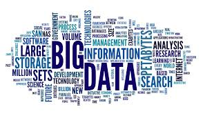

Es decir, nuestra sociedad se encuentra globalizada y profundamente interconectada a través de servicios computacionales, y por lo tanto, está generandouna cantidad masiva de datos no cada día, no cada hora, sino ... ¡cada minuto y segundo!

Pongamos un ejemplo, tal como cuando realizas una compra por Amazon (hipotéticamente, para este caso adquiriremos un smartphone). Entendamos el proceso desde 0:

- En un primer momento, empiezas a escoger en la página de amazon un telefono inteligente entre su vasta variedad de opciones (das click en diversos productos para analizar su calidad, costo y características)

- Parece que entre todos los telefonos que has visto, uno de ellos te ha llamada la atención y decides leer todas sus specs:

- Ahora bien, decides pagarlo e introduces toda la información respecto a la forma de pago, y además, se recolectan datos de tu ubicación y se configura un emparejamiento de la forma compra, envío, dirección de entrega y demás detalles:

Es decir, hemos hecho un proceso de compra muy simple y rutinario al cual estamos más que acostumrbados, pero imaginate que ese proceso no solo se desarrolla una vez: en nuestra ciudad hay miles y miles de personas que hacen compras por esta plataforma al día, y si a eso le sumamos no solo los compradores del resto de la república mexicana sino de toda América Latina, actualizandose por minuto, y además, a razón de que a Amazon le interesa rastrear patrones de compra-venta, telefonos más adquiridos, agrupar a sus clientes por segmentos para saber que tipo de promociones ofrecer, y tambíen desea conocer la ubicación donde más se compran ciertos telefonos para optimizar la distancia entre almacenes y canales de distribución... ¡toda la data requerida para hacer ese trabajo no podría almacenarse en un CSV como lo has venido haciendo y actualizarse a cada instante, ya que son millones y millones de transacciones por hora, y el tamaño y dimensiones de los datos son enormes!

## Reto 1: Describe a detalle una situación que involucre Big Data
- Por equipos o individualmente, describe una situación derivada de la prestación de un servicio digital como el que acabamos de observar (Amazon) que justo desarrolle una gran cantidad de datos y que de ellos, se puedan generar análisis (e.g. las estadísticas de visualizaciones diarias de los millones y millones de usuarios que tiene YouTube cada día)

Como te podrás dar cuenta, generalmente, cuando tenemos una enorme cantidad de datos generados por diversas fuentes computacionales, las cuales nos van retroalimentando continuamente sobre un ámbtito en particular, podemos empezar a pensar que estamos ante un fenómeno de Big Data

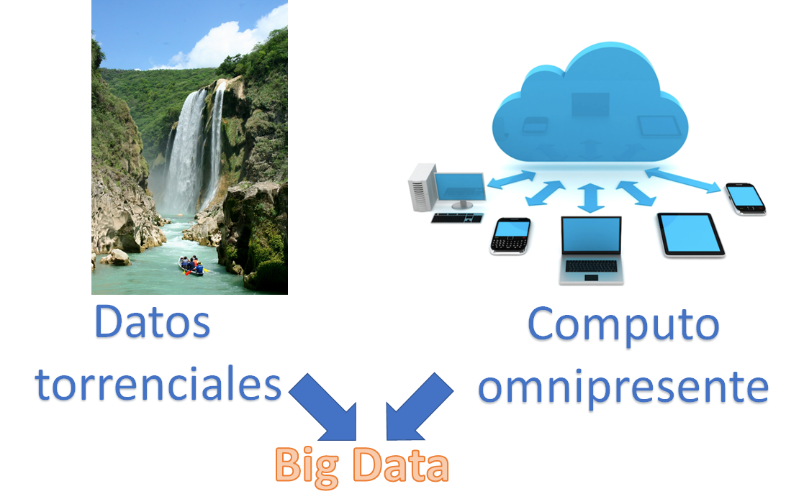

## Las 5 v's: donde se generan muchos datos, ¿hablaremos siempre de Big Data?

Es decir, hemos entendido que cuando un servicio en particular genera una gran canatidad de datos empieza a mostrarnos un primer rasgo de Big Data, pero cabe mencionar que no siempre que tenemos muchos datos, tendremos justamente 'Big Data'. Pongamos una serie de ejemplos claros:

- Imaginemos en un sistema de circuitos cerrados de video vigilancia grabando a una resolución 4K cada uno de los almacenes de una importante cadena de super mercado que tienen presencia en cada uno de los estados de nuestro país, con miles de establecimientos en cada poblado: se generan terabytes y terabytes de video cada día que son comprimidos y guardados en una base de datos gigantesca: de por medio observamos que en este ejemplo hay sistemas de computo y grabación conexos entre sí y una apabullante cantidad de datos, pero habría que preguntarse: ¿que utilidad existe en grabar todo el tiempo objetos que no están a la venta?, ¿esta enorme cantidad de datos es de utilidad?

- En este ejemplo, como otro ejemplo hipotético, pensemos que el gobierno empieza a recolectar información de la campaña de vacunación de todas las personas que han presentado algun efecto secundario por la vacuna de COVID-19 (desde computadoras ubicadas en los centros de vacunación y desde una app en el telefono de los vacunados).

Con base en la experiencia particular de cada uno de los vacunados, donde las autoridades han guardado cada una de los relatos como un string, pero los encargados del programa han olvidado desarrollar variables de escala para cuantificar el impacto, ni han desarrollado KPI's ni metrica alguna para identificar los casos de relevancia para las autoridades epidemiológicas: en este caso, aunque se cuenta con millones y millones de datos, los investigadores no desarrollaron una correcta conceptualización de los campos, preguntas y relaciones que deseaban cubrir, y aunque se cuenta con actualización en tiempo real de información y una cantidad torrencial de data, el proyecto ha quedado inservible por el mal diseño experimental.

Entonces, hay casos donde aunque contemos con mucha información, y también de diversas fuentes digitales, no estemos ante 'Big Data' como tal, entonces... ¿Cúales son los criterios para decidir si estamos ante Big Data?

## Ejemplo 02: Las 5 V's del Big Data

Así es, hay un criterio primordial para averiguar si estamos ante modelación de Big Data, y a este se le llama el criterio de las 5 v. Estudiemos a detalle cada una:

## Volumen

Empezaremos con la más obvia. Si contemplamos al big data como una pirámide, el volumen es la base. El volumen de datos que administran las empresas se disparó alrededor de 2012, cuando comenzaron a recopilar más de tres millones de datos tan solo por día las empresas. Desde entonces, este volumen se duplica aproximadamente cada 40 meses.

Recordemos que por allá del 2005, una PC comercial podía albergar en su HDD hasta 40 gb como máximo, pero esa capacidad de almacenamiento fue aumentando poco a poco (por ejemplo, poco despues, un Iphone pudo empezar a almacenar desde 8 gb en sus comienzos hasta poco más de 500 gb en años posteriores).

Recordemos la siguiente escala de almacenamiento:

- 1 000 000 000 000 000 000 000 000 = $10^24$ yottabytes	Y
- 1 000 000 000 000 000 000 000 = $10^21$ zettabytes	Z
- 1 000 000 000 000 000 000 = $10^18$ exabytes	E
- 1 000 000 000 000 000 = $10^15$ petabytes	P
- 1 000 000 000 000 = $10^12$ terabytes	T
- 1 000 000 000 = $10^9$ gigabytes	G
- 1 000 000 = $10^6$ megabytes	M
- 1 000 bytes = $10^3$ kilobytes	k

Veamos: tiene exabytes (aproximadamente 1,000 petabytes) y zettabytes (un poco más de 1,000 exabytes). En esta etapa, resulta difícil comprender qué significa todo esto en términos reales. Según una estimación de Cisco, el uso colectivo de Internet en el mundo alcanzó un zettabyte en 2016. ¡Se están viendo muchos videos de gatitos tiernos!

Pero no llegamos hasta ahí. Según la empresa de Business Intelligence IDC, la "esfera de datos global" en 2018 alcanzó los 18 zettabytes (1800% más que en 2016, ¡tan solo dos años!). Este es el total de todos los datos creados, capturados o replicados. (Sin embargo, no todos estos datos se almacenan y conservan.

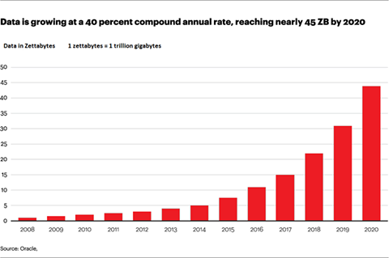

La gran mayoría de los datos del mundo se han creado en los últimos años y este asombroso crecimiento de datos no muestra signos de desaceleración. De hecho, IDC predice que los datos mundiales crecerán cerca de...  ¡175 zettabytes en 2025!

Si tuvieramos que almacenar y apilar 175 zettabytes en DVD, nuestra columna de DVD's sería lo suficientemente enorme como para dar la vuelta a la Tierra 222 veces.

Si intentamos descargar 175 zettabytes a la velocidad promedio actual de la conexión a Internet, la descarga tardaría 1,800 millones de años. Incluso si contrataramos a todas las personas del mundo para nos ayuden con la descarga, aún tomaría este proceso cerca de 81 días.

Es alucinante pensar que la humanidad está creando tal cantidad de data... Pensemos en la cantidad de datos que genera en un día promedio. Cada interacción con tu computadora o teléfono, tú estas creando datos. Cada interacción en las redes sociales crea datos. Cada vez que camina por la calle con un teléfono en el bolsillo, está rastreando su ubicación a través de sensores GPS: más datos. ¿Cada vez que compras algo con tu tarjeta de débito sin contacto? Datos. ¿Cada vez que lee un artículo en línea? Datos. ¿Cada vez que transmite una canción, película o podcast? Datos, datos, datos. Y ahora con la incurisón del internet de las cosas (la posibilidad de controlar tu refri, lavadora, focos, tu consola de videojuegos vía remota por medio de una conexión a internet), creas más datos aún.

Como ejemplo, veamos el uso de las redes sociales en 2018. En solo un minuto:

- Los usuarios de Twitter enviaron 473,400 tweets
- Los usuarios de Snapchat compartieron 2 millones de fotos
- Los usuarios de Instagram publicaron 49,380 fotos
- LinkedIn ganó 120 nuevos usuarios

Otras estadísticas increíbles sobre la generación de data incluyen:

- Google procesa más de 40.000 búsquedas por segundo, o 3.500 millones de búsquedas al día.
- 1.5 mil millones de personas están activas en Facebook todos los días. Eso es una quinta parte de la población mundial.
- Dos tercios de la población mundial ahora poseen un teléfono móvil.
- Cuando miras estadísticas como estas, no es difícil ver cómo los datos del mundo se han disparado en los últimos años y seguirán creciendo a un ritmo increíble. Queda por ver si alcanzaremos esa gran cantidad de 175 zettabytes en 2025, pero una cosa es segura: generaremos muchísimos más datos de los que ya estamos.

Y por eso mismo, los profesionales formados para modelar, aprovechar y explotar esta enorme cantidad de data como tú lo aprenderás en este curso, ¡serán altamente requeridos y valorados en la industria de Ciencia de Datos!

## Velocidad

Además de administrar los datos, las empresas necesitan que la información fluya rápidamente, lo más cerca posible del tiempo real. Tanto es así que el ejecutivo de MetLife enfatizó que: “La velocidad puede ser más importante que el volumen porque puede brindarnos una ventaja competitiva mayor. A veces es mejor tener datos limitados en tiempo real que muchos datos a baja velocidad "

Los datos deben estar disponibles en el momento adecuado para tomar decisiones comerciales adecuadas. La experta en análisis de datos Gemma Muñoz dio un ejemplo: en los días en que se celebran los partidos de fútbol de la Champions League, la empresa española de entrega de comida 'La Nevera Roja' (que fue adquirida por Just Eat en 2016) decide si comprar una campaña de Google AdWords en función de su datos de ventas 45 minutos después del inicio del juego. Tres horas después, esta información ya no es importante.

## Variedad

La segunda V del big data es la variedad. Una empresa puede obtener datos de muchas fuentes diferentes: desde dispositivos internos hasta tecnología GPS para teléfonos inteligentes o lo que la gente dice en las redes sociales. La importancia de estas fuentes de información varía según la naturaleza del negocio. Por ejemplo, un producto o servicio de mercado masivo debería ser más consciente de las redes sociales que una empresa industrial.

Estos datos pueden tener muchas capas, con diferentes valores. Por ejemplo, cuando se lanza una campaña de marketing por correo electrónico, no solo se desea saber cuántas personas abrieron el correo electrónico, sino, lo que es más importante, cómo son esas personas. Imaginate una vez más el caso de fallo del que hablamos de la obtención de información de las personas vacunados: en ese caso en particular, la V de variedad no se contempló en lo absoluto.

## Veracidad

La cuarta V es la veracidad, que en este contexto equivale a la calidad. Tenemos todos los datos, pero ¿podría faltar algo? ¿Son los datos "limpios" y precisos? ¿Tienen realmente algo que ofrecer?

Así mismo, esta V tiene que ver con el concepto de data integrity. La integridad de los datos se define como el mantenimiento, la garantía de la precisión y consistencia de los datos durante todo su ciclo de vida y es un aspecto crítico para el diseño, implementación y uso de cualquier sistema que almacene, procese o recupere datos.

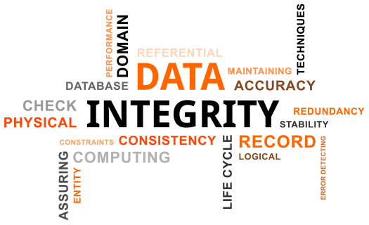

## Valor

Finalmente, la V de valor se encuentra en la parte superior de la pirámide de big data. Esto se refiere a la capacidad de transformar un torrente de datos en negocios.

En el caso de las compañías de seguros, con el provecho del Big Data, ahora pueden saber, en un período de dos meses cuando mucho, cuándo es muy probable que un cliente cancele su póliza o compre una nueva.

Es decir, solo resulta de provecho que una organización se de el tiempo y costos de infraestructura de hardware y personal para almacenar y procesar una gran cantidad de datos solo si sabe que le generará alguna clase de retorno y puede generar provecho de los mismos.

Pero el poder de los macrodatos abarca más que solo proyecciones. En el mismo ejemplo de aseguradoras, También pueden localizar a sus clientes más importantes, a quienes llaman 'Snoopy' (en el caso de MetLife) y pueden saber cuáles no tienen ningún valor, ya sea porque cancelan con frecuencia, los data scientist de esa empresa han descubierto que ellos están buscando descuentos o podemos tener sospechas de fraude. Son clientes con un perfil similar, pero también muy diferentes. Hace años, sin la ayuda del Big Data era díficil de distinguirlos. Ahora, es posible.

Después de una importante inversión en tiempo y recursos, si una empresa utiliza correctamente el big data, puede generar capacidad para conocer a sus clientes y monetizar toda esa información. Pueden ofrecer a los clientes lo que quieren o necesitan en el momento adecuado: la generación del mítico y tan esperado 'unicorn' por parte de los negocios que emplean el proceso de Ciencia de Datos.

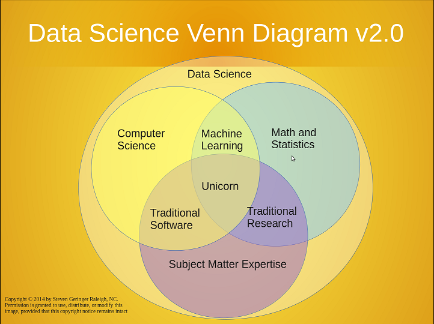

# Reto 02: Genera hipotéticamente un proceso Big Data

Ahora que conoces el proceso del Big Data, y que existen 5 requisitos para que hablemos de que estemos ante un caso de Grandes Datos (que se den cada una de las 5 V's), ahora es tu turno. Por equipo o individualmente, anota detalladamente como es que el ejemplo que brindaste en el Reto 01 cumple con las 5 V's. 

Cuando pases ante el grupo, deberás explicar porque el proceso del que hablas si es un problema de Big Data respecto a los requisitos de veracidad, velocidad, volumen, valor y variedad.

## ¿Bien, y que software y lenguajes se usan en la Industria del Big Data?

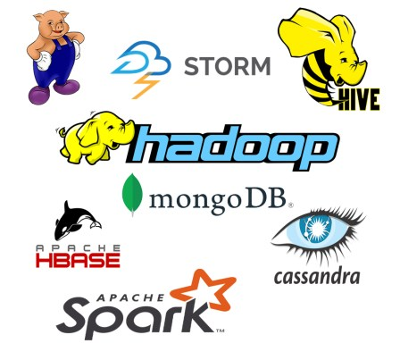

Una cosa muy importante que debes comprender es que cuando nos afrontamos a problemas de Big Data, en la gran mayoría de las ocasiones, el almacenamiento y poder de computo ofrecido por una sola computadora es totalmente insuficiente (imagina el caso de la gran Katie Bouman, científica de la NASA quien lideró un equipo capaz de procesar una enorme cantidad de datos para recrear la primer imagen en la historia de un Agujero Negro: se ocuparon cerca de 5 Petabytes en distintos HDD distribuidos)

Y así, se logró recrear la imagen que tiene a continuación:

Cuandro afrontes problemas de Big Data, procesarás una cantidad per se enorme e increíble de datos, pero no solo eso: ¿recuerdas la V de velocidad? Así es, damas y caballeros, esa información podría no cabrá ni en un HDD de 15 Terabytes de alta calidad que hayas comprado, y ni aunque tengas un AMD-Ryzen 9 o un Intel i9, tu computadora será capaz de procesarlo: estamos obligados a recurrir al cluster computing o computo paralelo

##### ¿Que es cluster computing o computo paralelo?

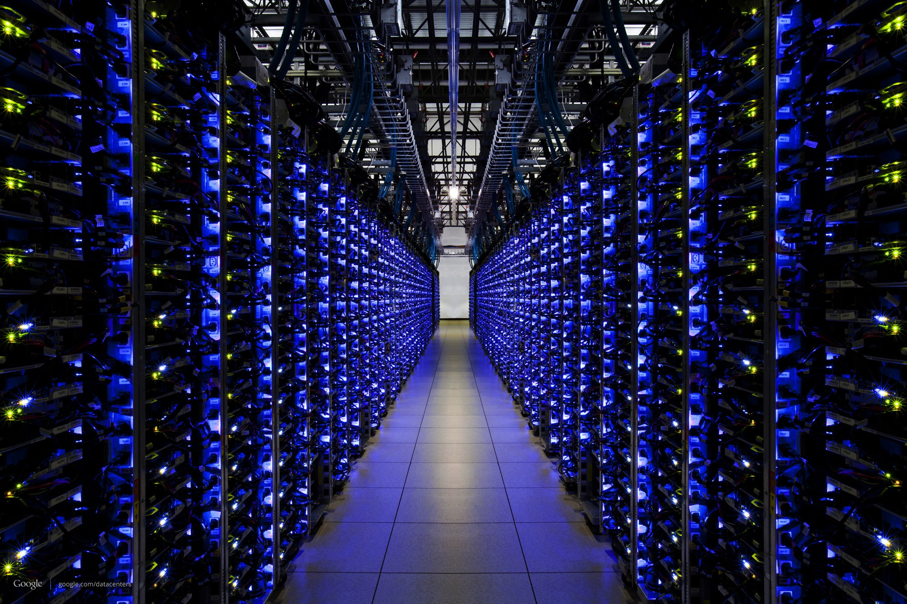

Cuando debemos procesar muchos datos, y una sola computadora no es suficiente, entonces podemos usar una n cantidad de computadoras interconectadas y sincronizadas para efectivamente procesar esos datos. Te pongo un ejemplo:

- Imagina que escaneamos 1000 Terabytes de datos en un solo nodo de procesamiento a una velocidad de 100 Megabytes por segundo: ¡tardaremos aproximadamente 24 días en acompletar la tarea!
- Ahora, imaginemos que de forma "paralela", pongamos a procesar esos 1000 TB en 1000 distintos nodos: ¡tardaríamos tan solo 35 minutos!

En este orden de ideas, seguramente te preguntarás: ¿Cómo puedo implementar el computo paralelo para procesar Big Data? La respuesta es sencilla: ¡Apache Hadoop! Básicamente lo que hace Hadoop es distribuir las tareas de procesamiento de datos en varios nodos de computo, tal como se explica en el siguiente diagrama:

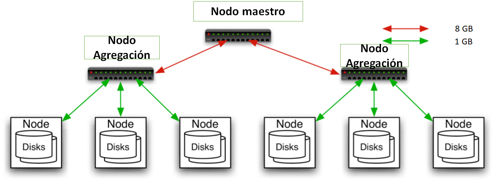

En este breve diagrama, contamos con un nodo maestro que necesita procesar 8 GB de datos, pero distribuye la tarea a otros dos de agregación, y a su vez, estos distribuyen la tarea a otros 6 distintos (se distribuye 1 GB a cada uno, y los nodos de agregación se quedan cada uno con 1 GB para procesar). La tarea se distribuyó entre 8 distintos nodos de procesamiento satisfactoriamente. Ahopra bien, te preguntarás cual es la metología en Hadoop para desarrollar esta tarea... y es

El modelo de programación MapReduce. Básicamente consta de los siguientes pasos:

- Almacenamiento de la data en archivos distribuidos
- Diseño de tareas distribuidas a través de key-value pairs
- Dichas tareas se procesan en diferentes nodos físicos de procesamiento distribuido
- El output del procesamiento se almacena en un sistema HDFS (Hadoop Distributed Fyle System), el cual parece haberse desarrollado en una sola máquina pues fue integrado en un solo archivo.

## Ejemplo 03: El ambiente Apache

Continuemos con el siguiente tema del día de hoy, profundizaremos en Hadoop y comprenderemos que softwares y lenguajes usaremos a lo largo de todo el presente curso: Apache

Los ambiente de trabajo Apache para Big Data administration son los más usado por toda el gremio dedicado a procesar y analizar Big Data, y fue creado por The Apache Software Foundation, una organización sin animos de lucro fundada el 25 de marzo 1999. El software que producen se distribuye según los términos de la licencia Apache y es software gratuito y de código abierto. Los proyectos de Apache se caracterizan por un proceso de desarrollo colaborativo, basado en el consenso y la filosofía de licencias de software abiertas y gratuitas (es decir, ¡no tiene costo alguno al igual que los poderosos Python y R!).

Presentemos rapidamente algunos de los softwares de Apache que aprenderemos a dominar:

## El ecosistema Hadoop

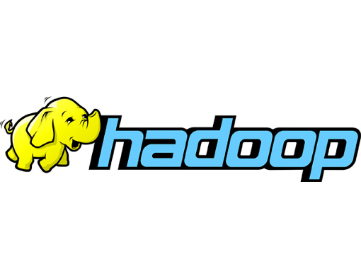

La popularidad de Hadoop ha generado herramientas patentadas y de código abierto para hacer que Apache Hadoop sea más fácil de usar y proporcionar funciones y características adicionales. Esta parte del capítulo examina los siguientes proyectos de Apache relacionados con Hadoop:
- Pig: proporciona un lenguaje de programación de flujo de datos de alto nivel
- Hive: proporciona acceso similar a SQL
- Mahout: proporciona herramientas analíticas y de desarrollo de Machine Learning
- HBase: ofrece lecturas y escrituras en tiempo real

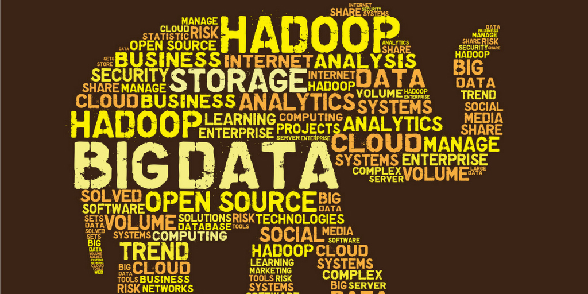

Al enmascarar los detalles necesarios para desarrollar un programa MapReduce, Pig y Hive permiten a un desarrollador
para escribir código de alto nivel que luego se traduce en uno o más programas MapReduce.

Debido a que MapReduce está diseñado para el procesamiento por lotes, Pig y Hive también están diseñados para casos de uso de procesamiento por lotes. Una vez que Hadoop procesa un conjunto de datos, Mahout proporciona varias herramientas que pueden analizar los datos en un entorno Hadoop. Por ejemplo, se puede realizar un análisis de agrupamiento de k-means usando Mahout.

A diferencia del procesamiento por lotes de Pig and Hive, HBase ofrece la capacidad de realizar lectura y escritura de datos almacenados en tu entorno Hadoop. Este acceso en tiempo real se logra en parte almacenando datos en la memoria, así como en HDFS (Hadoop Distributed File System).

Además, HBase no depende de MapReduce para acceder a los datos, debido a que el diseño y el funcionamiento de HBase es significativamente diferentes de las bases de datos relacionales SQL. No te preocupes, en este modúlo te ofreceremos una introducción completa y amigable a cada una de estas herramientas para que en modúlos posteriores, puedes aprenderlas a dominar con soltura y libertad.

## El ecosistema de trabajo de Apache Spark

A la par de Hadoop, tenemos un ambiente de trabajo paralelo ofrecido por la mismisima Apache, y este es nada más ni nada menos que el ecosistema Apache Spark. Hay científicos de datos e ingenieros que opinan este será el gran sucesor de Hadoop, esto debido a su gran éxito, pues es más rápido que Hadoop: se estima que es 100 veces más ágil en cálculo de memoria y 10 veces más veloz en disco. Además, puede operarse con cuatro lenguajes distintos: Scala, Python, R y Java. Además de su clara versatilidad, tambien tiene un robusto y bien diseñado ambiente de trabajo tal como lo posee Hadoop: Spark SQL, MLlib, GraphX y Spark Streaming.

No obstante, Hadoop sigue siendo ampliamente utilizado por la confianza de la industria (lleva presente más de 15 años), pero a su vez, varias compañías ya están implementando Spark. No te preocupes, aprenderás ambas herramientas de Apache. Además, en algunos puntos, ambos ambientes se complementan, pues Spark no tiene su propia administración de archivos y por eso debe apoyarse en el HDFS del buen Hadoop.

## NoSQL: Apache Cassandra

Como te podrás haber dado cuenta, al usar una cantidad torrencial de datos, no podemos alojar nuestros datos en un único servidor, y por tanto, el SQL clásico al cual estamos acostumbrados de toda la vida, es insuficiente para cubrir las demandantes tareas que exige el Big Data: NoSQL es el siguiente paso, ya que entre muchos factores, debes recordar que SQL es escalable verticalmente, por lo tanto, resulta mucho más díficil de manejar Big Data; NoSQL es escalable horizontalmente.

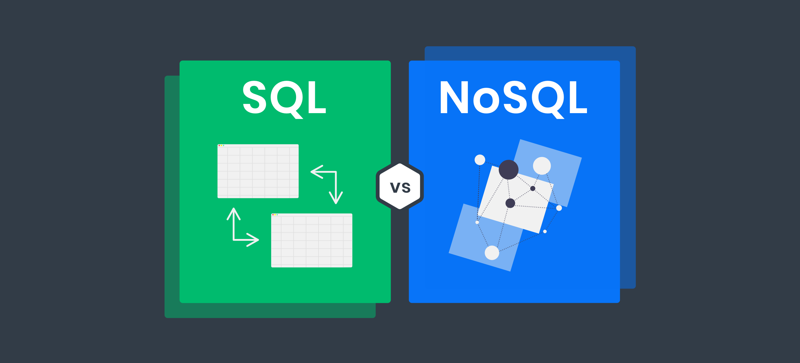

Apache Cassandra es una de los administradores de bases de datos NoSQL más eficientes y más utilizadas. Uno de los beneficios clave de este sistema es que ofrece un servicio de alta disponibilidad y ningún punto único de falla. Esto es clave para las empresas que pueden darse el lujo de que su sistema se caiga o pierdan datos. Sin un solo punto de falla, ofrece acceso y disponibilidad verdaderamente consistentes.

Otro beneficio clave de Cassandra es el enorme volumen de datos que puede manejar. Es capaz de manejar de forma eficaz y eficiente grandes cantidades de datos en varios servidores. Además, puede escribir rápidamente grandes cantidades de datos sin afectar la eficiencia de lectura. Cassandra ofrece a los usuarios velocidades de escritura increíblemente rápidas y la velocidad o precisión no se ven afectadas por grandes volúmenes de datos. Es tan rápido y preciso para grandes volúmenes de datos como para volúmenes más pequeños (¡así es, también resulta útil para problemas de Ciencia de Datos más comunes!).

Otra razón por la que tantas empresas utilizan Cassandra es su escalabilidad horizontal. Su estructura permite a los usuarios satisfacer los aumentos repentinos de la demanda, ya que les permite simplemente agregar más hardware para ingresar más clientes/Usuarios y datos adicionales. Esto hace que sea fácil de escalar sin paradas ni ajustes importantes necesarios. Además, su escalabilidad lineal es una de las cosas que ayuda a mantener el tiempo de respuesta rápido del sistema.

Aún así, no te preocupes, en modulos posteriores también estudiarás una introducción a MongoDB (un administrador NoSQL que también es ampliamente usado)

## Reto 3: Resuelve un problema de Data Analysis al que te afrontaste y que con lo que sabes ahora, hubieras podido aplicar Hadoop MapReduce (en caso que no tengas uno, genera un caso hipotético)

En equipos o individualmente, piensa en un problema al cual te afrontaste y por las dimensiones del dataset o la complejidad del algoritmo o modelación que usaste y el tiempo de computo trancurrido, te hubiera sido ampliamente benefico haber empleado el modelo de programación MapReduce del cual hablamos hace unos minutos. 

Por ejemplo, en uno de los problemas que resolví hace tiempo, entrené una red neuronal convulsiva con un data set de entrenamiento de 5 GB, y el tiempo de entrenamiento fue de nada más ni nada menos de 2 días con tres horas, con un uso de mi Ryzen 7 al 100% (y por si te lo preguntas, si, la factura de la luz llego más cara de lo habitual). De haber usado computo paralelo con Hadoop para resolver mi problema, la hubiera podido entrenar en menos de una hora.

## Ejemplo 4: Los proyectos de Big Data para el módulo

Como tú bien sabes, en Bedu incentivamos tu aprendizaje con base en un proyecto que irás desarrollando a lo largo del módulo, ello con miras a que puedas aprender y poniendo en práctica tu conocimiento en el mismo proceso. No obstante, al hablar de Big Data (y que en la enorme mayoría de los casos, los archivos de Big Data pueden resolverse en un solo nodo de procesamiento, tal como nuestro PC), es necesario emular el proceso de modelado, clusters de computo y análisis de datos en Hadoop con nodos simulados.

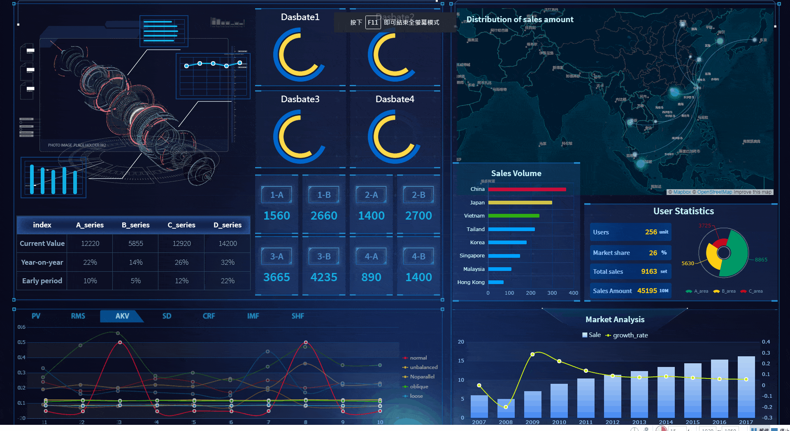

Así mismo, para el tema de tu dataset, debemos usar uno relativamente grande (en promedio, más allá de los 3 GB) para poder emular lo mejor posible un proceso de Big Data. En este momento, puedes hablar con el Experto para que te ayude a conceptualizar y empezar a cimentar las bases de tu proyecto.

## Reto 4: Comienza a idear tu proyecto con ayuda del Experto

Con lo anteriormente dicho, es hora de que empieces a idear tu proyecto. Puedes reciclar uno de tus trabajados del pasado que haya requerido el procesamiento de un o varios datasets relativamente grandes. Comentale tu idea al Experto o alguno de los TAA para ver si es factible y es compatible con el trabajo que desarrollarás a lo largo del módulo y todo el curso.

