# Ejemplo 01 - Instalación de Java

## Objetivo

* Instalar directamente Java en la raíz de la unidad donde tienes Windows, ello como un preparativo sine qua non para poder instalar y correr satisfactoriamente Hadoop

Es necesario instalar Java en tu computadora para poder correr Hadoop. Para ello tuviste que haber descargado previamente la versión 8 de Java (tal como venía en el desarrollo del prework)

## Desarrollo: Instala Java como una variable de sistema (y en el root de tu unidad)

Una vez aceptes los términos y condiciones, junto con la creación de tu cuenta, habrá descargado el archivo .exe de Java. Procederemos a copiar el archivo descargado a la raíz de la unidad donde tienes instalado Windows:

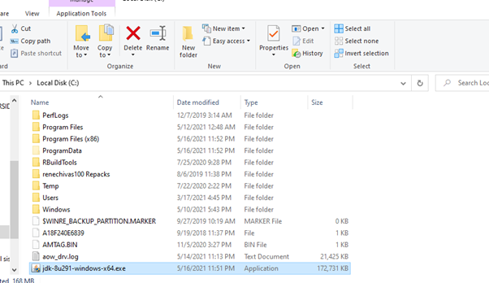

Cuando hayas avanzado en el instalador de Java, debes cambiar la ruta de instalación dando click en change (debes crear una carpeta llamada ‘Java’ en la raíz de tu unidad):

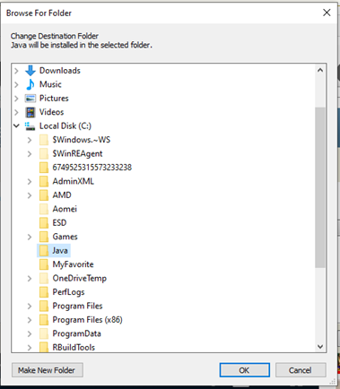

Tu instalador debería verse así:

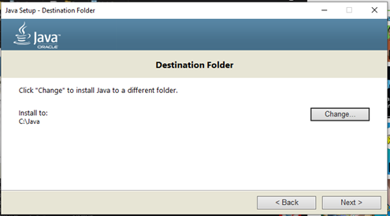

Da click en Next y espera la instalación haya concluido. Una vez instalado, accede a Program Files, busca Java, y accede a la carpeta JDK:

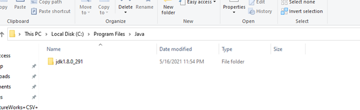

- Corta y pega esa carpeta a la carpeta “Java” ubicada en la raíz de tu unidad. Una vez hecho, puedes borrar la otra carpeta vacía Java ubicada en program files.
- Una vez instalado Java, debes fijarlo como una environment variable en Windows. En Windows 10, abierto el menú principal, da click en configuración:

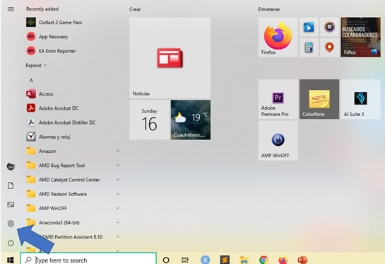

Una vez ahí, da click en Sistema o System:

Busca editar las variables de ambiente o edit the system environment variables:

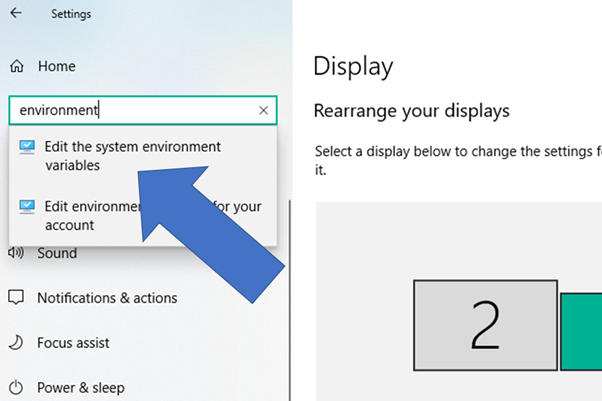

Selecciona Variables de ambiente o Environment variables:

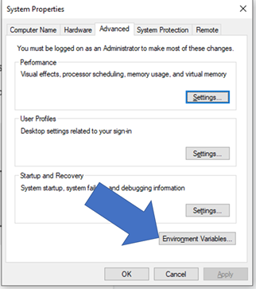

Selecciona Nuevo o New:

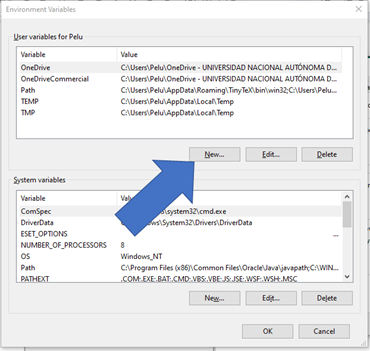

Ahora, llamale a la Variable como ‘JAVA_HOME’ y en la ubicación accede a la carpeta ‘Java’ en la raíz de tu unidad, después a JDK, y por último a bin. Copia y pega la ruta en ese campo:

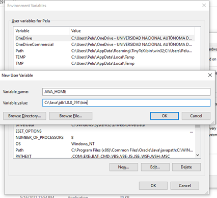

Ahora ve a System variables, Path, y da click en Edit:

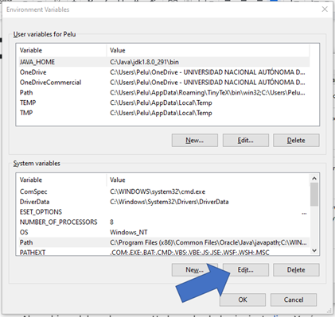

Da click en New, y vuelve a pegar la misma ruta:

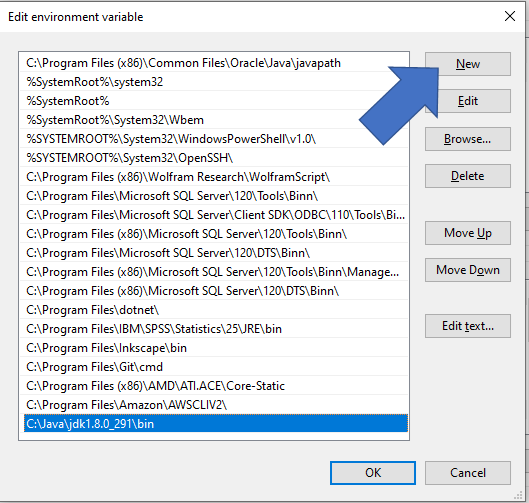

- Da click en OK, y cierra esa ventana. Ahora Java es parte de tu ambiente nativo de trabajo en Windows.
- Para probarlo, abre un command prompt (abre la barra de tareas y escribe ‘CMD’). Al abrirla, escribe ‘java’ y correlo. Debería aparecerte la siguiente pantalla:

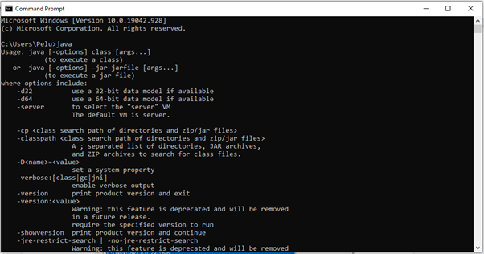

Comprueba tu versión de Java con el comando ‘java -version’. Debería aparecerte algo así:

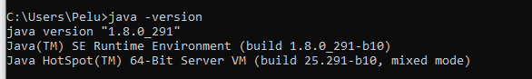
