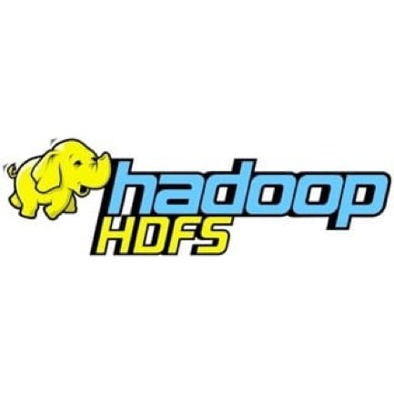
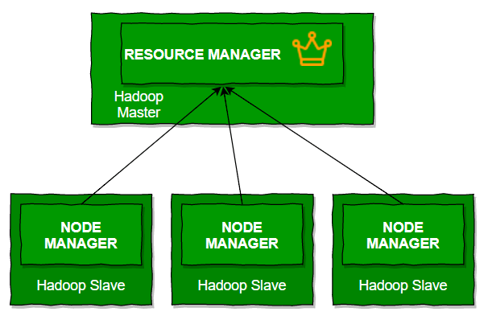

# Comprendiendo la arquitectura de HDFS

El Hadoop File System o HDFS se puede presentar como la arquitectura de Hadoop, donde siempre tendremos un nodo maestro y otros esclavo. El nodo maestro HDFS se denomina NameNode, mientras que el esclavo es DataNode. NameNode es un servidor que administra el espacio de nombres del sistema de archivos y ajusta el acceso (abrir, cerrar, renombrar y más) a los archivos por parte del cliente. También ivide los datos de entrada en bloques y anuncia qué bloque de datos se almacenará en qué DataNode. DataNode es esclavo de NameNoede y almacena las réplicas del conjunto de datos particionado y sirve los datos cuando llega la solicitud. También realiza la creación y eliminación de bloques. El mecanismo interno de HDFS divide el archivo en uno o más bloques; estos bloques se almacenan en un conjunto de nodos de datos. En circunstancias normales del factor de replicación tres, la estrategia de HDFS es colocar la primera copia en el nodo local, la segunda copia en el rack local con un nodo diferente y una tercera copia en diferentes racks con diferentes nodos. Como HDFS está diseñado para admitir archivos grandes, el tamaño de bloque de HDFS se define como 64 MB. Si es necesario, esto se puede aumentar.

# Accedamos al YARN

Yarn (Yet Another Resource Negotiator) es una pieza fundamental en el ecosistema Hadoop. Es el framework que permite a Hadoop soportar varios motores de ejecución incluyendo MapReduce, y proporciona un planificador agnóstico a los trabajos que se encuentran en ejecución en el clúster. Esta mejora de Hadoop también es conocida como Hadoop 2.

Yarn separa las dos funcionalidades principales: la gestión de recursos y la planificación y monitorización de trabajos. Con esta idea, es posible tener un gestor global (Resource Manager) y un Application Master por cada aplicación.

## Resource Manager

El Resource Manager (RM) tiene dos componentes: El Scheduler y el Applications Manager.

El Scheduler o planificador es el encargado de gestionar la distribución de los recursos del clúster de Yarn. Además, las aplicaciones usan los recursos que el Resource Manager les ha proporcionado en función de sus criterios de planificación. Este planificador no monitoriza el estado de ninguna aplicación ni les ofrece garantías de ejecución.

Por otro lado, el Applications Manager es el componente del Resource Manager responsable de aceptar las peticiones de trabajos, negociar el contenedor en el que ejecutar la aplicación y proporcionar reinicios de los trabajos en caso de que fuera necesario debido a errores.

El Resource Manager mantiene un listado de los Node Manager activos y de sus recursos disponibles. Los clientes del sistema pueden enviar una aplicación Yarn soportada para ejecutar al Resource Manager.

## Node Manager

Node Manager
El Node Manager (NM) gestiona los trabajos con las instrucciones del Resource Manager y proporciona los recursos computacionales necesarios para las aplicaciones en forma de contenedores. Implementa Heartbeats para mantener informado del estado al Resource Manager.

Los contenedores Yarn tienen una asignación de recursos (cpu, memoria, disco y red) fija de un host del clúster y el Node Manager es el encargado de monitorizar esta asignación. Mapean las variables de entorno necesarias, las dependencias y los servicios necesarios para crear los procesos.

## Application Master

El Application Master (AM) es el responsable de negociar los recursos apropiados con el Resource Manager y monitorizar su estado y su progreso. También coordina la ejecución de todas las tareas en las que puede dividirse su aplicación.

# Manos a la obra: Inicializar Hadoop

A continuación vamos a correr un cluster con un único solo nodo tal como lo planificamos en el ejemplo 02 (es decir, emularemos el computo paralelo pero con una sola celula). Vamos a iniciarlizar el NameNode configurado de la siguiente forma: abre tu Windows Command Prompt o tu Terminal Linux y escribe lo siguiente

hdfs namenode -format

si todo ha salido bien, debería aparecerte despues de ese comando lo siguiente:

Tu Namenode ha sido inicialiado (puedes cerrar la ventana). Abre un nuevo CMD o Terminal y haz un change directory para acceder a la carpeta de Hadoop que está en el root de tu unidad. En caso de no saber en que carpeta estás, usa dir:

En mi caso usaré cd.. (ir al folder previo) hasta llegar al root de mi unidad

Listo, haré un cd a hadoop, y de ahí a sbin. Cuando estés situado en sbin, corre start-all:

Ahora estás en YARN Hadoop:

con el comando JPS podemos saber que procesos Java se están ejecutando (nodos):

