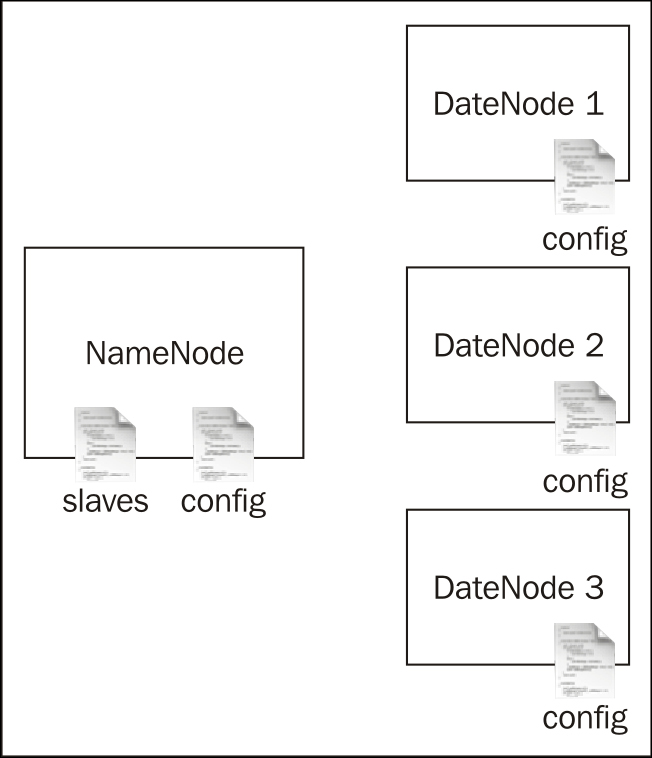

# Ejemplo 03: Introducción a HDFS y configuración local

HDFS es el sistema de archivos distribuido que está disponible con Hadoop. Las tareas de MapReduce utilizan HDFS para leer y escribir datos. La implementación de HDFS incluye un solo NameNode y varios DataNodes.



Para la configuración de HDFS, necesitamos configurar NameNodes y DataNodes, y luego especificar los DataNodes en el archivo esclavo. Cuando iniciamos el NameNode, el script de inicio iniciará los DataNodes.

## Vamos a comenzar!

Puedes seguir este work utilizando una sola máquina o varias máquinas. Si está utilizando varias máquinas, debe elegir una máquina como nodo principal donde ejecutará HDFS NameNode. Si está utilizando una sola máquina, utilícela como NameNode y como DataNode.

- Es necesario tener Java en todas las máquinas virtuales o las computadoreas que se utilizarán para configurar el clúster HDFS.

- Si estás utilizando una computadora con Windows, instala Cygwin y el servidor SSH en cada máquina. El enlace http://pigtail.net/LRP/printsrv/cygwin-sshd.html proporciona instrucciones paso a paso.

Habilite SSH de los nodos maestros a los nodos esclavos. Compruebe que puede iniciar sesión en localhost y en todos los demás nodos utilizando SSH sin una frase de contraseña ejecutando uno de los siguientes comandos:

```
>ssh localhost

>ssh IPaddress
```

Si el comando anterior devuelve un error o solicita una contraseña, cree claves SSH ejecutando el siguiente comando:

```
>ssh-keygen -t dsa -P '' -f ~/.ssh/id_dsa
```

Mueve el archivo ``` ~ / .ssh / id_dsa.pub ``` a todos los nodos del clúster. Luego, agregue las claves SSH al archivo ``` ~ / .ssh / authorized_keys ``` en cada nodo ejecutando el siguiente comando (si el archivo autorizado_keys no existe, ejecute el siguiente comando. De lo contrario, vaya al comando ```cat ```):

```
>touch ~/.ssh/authorized_keys && chmod 600 ~/.ssh/authorized_keys
```

Ahora con los permisos establecidos, agregue su clave al ``` ~/.ssh/authorized_keys file```.

```
>cat ~/.ssh/id_dsa.pub >> ~/.ssh/authorized_keys
```
Luego puede iniciar sesión con el siguiente comando:

```
>ssh localhost
```

Este comando crea un par de claves SSH en el directorio .ssh / del directorio de inicio y registra la clave pública generada con SSH como clave de confianza.

En cada máquina, cree un directorio para almacenar datos HDFS. Llamemos a ese directorio HADOOP_DATA_DIR. Ahora creemos dos subdirectorios, HADOOP_DATA_DIR / data y HADOOP_DATA_DIR / name. Cambie los permisos del directorio a 755 ejecutando el siguiente comando para cada directorio:

```
>chmod 755 <name of dir>
```

En NameNode, cambie el directorio al directorio ```HADOOP_HOME``` descomprimido. Luego coloque la dirección IP de todos los nodos esclavos en el archivo ```HADOOP_HOME / conf / slaves```, cada uno en una línea separada. Cuando iniciamos el NameNode, usará el archivo esclavos para iniciar los DataNodes.

En todas las máquinas, edite el archivo ```HADOOP_HOME / conf / hadoop-env.sh``` descomentando la línea ```JAVA_HOME``` y apuntándolo a su instalación Java local. Por ejemplo, si Java está en /opt/jdk1.9, cambie la línea ```JAVA_HOME``` para exportar ```JAVA_HOME = / opt / jdk1.6```.

Dentro del directorio ```HADOOP_HOME / conf``` de cada nodo, agregue el siguiente código a los archivos ```core-site.xml``` y ```hdfs-site.xml```. Antes de agregar las configuraciones, reemplace las cadenas MASTER_NODE con la dirección IP del nodo maestro y ```HADOOP_DATA_DIR``` con el directorio que creó en el primer paso.


```
<configuration>
<property>
<name>fs.default.name</name>
<!-- URL of MasterNode/NameNode -->
<value>hdfs://MASTER_NODE:9000/</value>
</property>
</configuration>

HADOOP_HOME/conf/hdfs-site.xml

<configuration>
<property>
<name>dfs.name.dir</name>
<!-- Path to store namespace and transaction logs -->
<value>HADOOP_DATA_DIR/name</value>
</property>
<property>
<name>dfs.data.dir</name>
<!-- Path to store data blocks in datanode -->
<value>HADOOP_DATA_DIR/data</value>
</property>
</configuration>

```
Desde NameNode, ejecute el siguiente comando para formatear un nuevo sistema de archivos:


```
> bin / hadoop namenode –format

12/04/09 08:44:50 INFO namenode.NameNode: STARTUP_MSG:
/ *********************************************** ***********
...
12/04/09 08:44:51 INFO common.Storage: El directorio de almacenamiento / Users / srinath / playground / hadoop-book / hadoop-temp / dfs / name se ha formateado correctamente.
12/04/09 08:44:51 INFO namenode.NameNode: SHUTDOWN_MSG:
/ *********************************************** ***********
SHUTDOWN_MSG: Apagando NameNode en Srinath-s-MacBook-Pro.local / 172.16.91.1
************************************************ ********** /
```
Inicie la configuración de HDFS con el siguiente comando:

```
> bin / start-dfs.sh
```

Este comando primero iniciará un NameNode. Luego buscará en el archivo HADOOP_HOME / conf / slaves e iniciará los DataNodes. Imprimirá un mensaje como el siguiente en la consola.

```
starting namenode, logging to /root/hadoop-setup-srinath/hadoop-1.0.0/libexec/../logs/hadoop-root-namenode-node7.beta.out
209.126.198.72: starting datanode, logging to /root/hadoop-setup-srinath/hadoop-1.0.0/libexec/../logs/hadoop-root-datanode-node7.beta.out
209.126.198.71: starting datanode, logging to /root/hadoop-setup-srinath/hadoop-1.0.0/libexec/../logs/hadoop-root-datanode-node6.beta.out
209.126.198.72: starting secondarynamenode, logging to /root/hadoop-setup-srinath/hadoop-1.0.0/libexec/../logs/hadoop-root-secondarynamenode-node7.beta.out
```

Hadoop utiliza una arquitectura centralizada para metadatos. En este diseño, el NameNode contiene la información de todos los archivos y dónde se encuentran los bloques de datos para cada archivo. NameNode es un único punto de falla y, en caso de falla, detendrá todas las operaciones del clúster HDFS. Para evitar esto, Hadoop admite un NameNode secundario que contendrá una copia de todos los datos en NameNode. Si el NameNode falla, el NameNode secundario ocupa su lugar.

Acceda al enlace ```http: // MASTER_NODE: 50070 /``` y verifique que puede ver la página de inicio de HDFS. Aquí, reemplace MASTER_NODE con la dirección IP del nodo maestro que ejecuta HDFS NameNode.

Finalmente, apague el clúster HDFS con el siguiente comando:

```
> bin / stop-dfs.sh
```