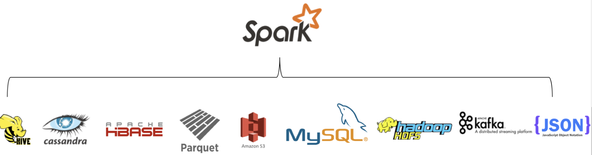
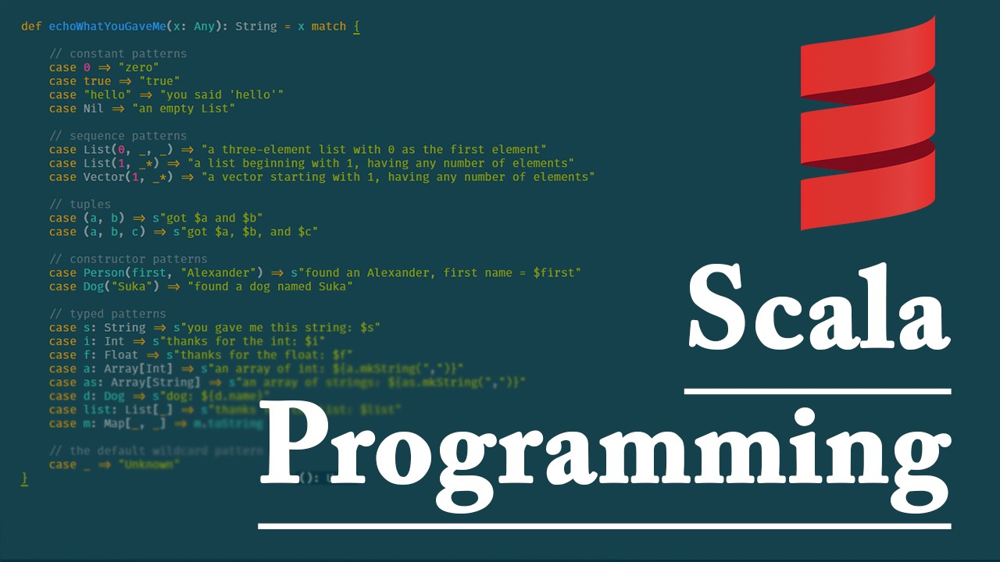
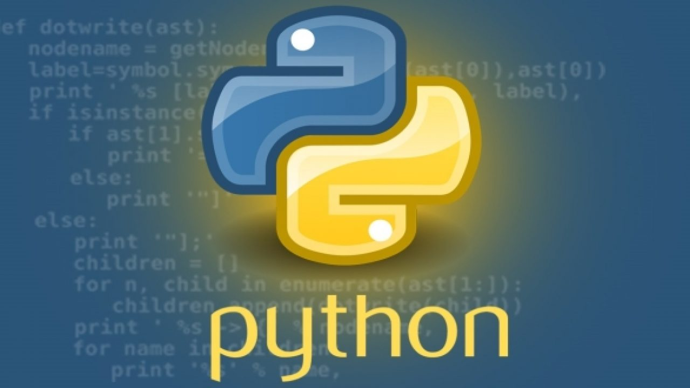
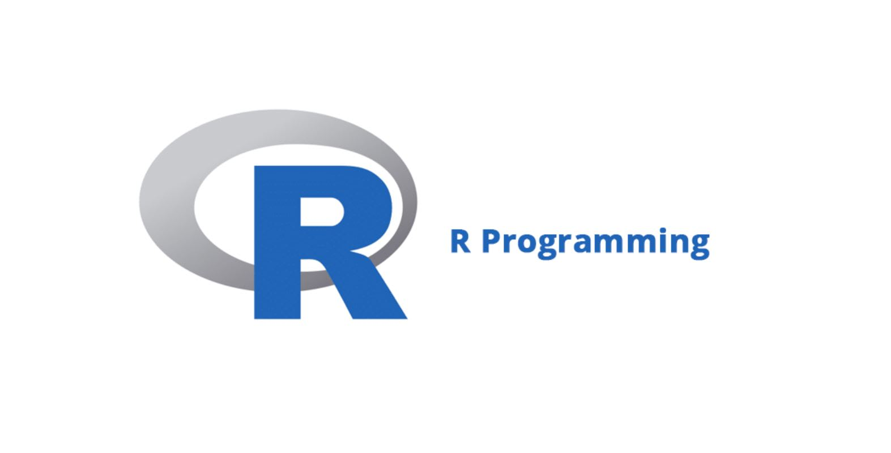

# Ejemplo 1 - Introducción a Spark

## Desarrollo

¿Qué es Spark?
Apache Spark es un framework informático de computo distribuido que hace que el procesamiento de big data sea bastante fácil, rápido y escalable. Seguramente ya has escuchado de este framework en muchos lados (se requiere bastante en el ámbito laboral): Spark es muy popular en la industria y se diferencia de las herramientas existentes disponibles para el procesamiento de macrodatos por ciertas cuestiones que veremos a detalle en el desarrollo de las próximas sesiones. Una de las principales razones es que proporciona una forma unificada para procesar todos los diferentes tipos de big data, ya sea por lotes, transmisión, Machine Learning o visualizaciones.

Spark se desarrolló en AMPLab de la University of California Berkeley en 2009 y luego se incluyó en Apache Umbrella en 2010. El framework está escrito en Scala y Java.

Spark proporciona una interfaz con muchos almacenes de datos distribuidos y no distribuidos, como Hadoop Distributed File System (HDFS), Cassandra, Openstack Swift, Amazon S3 y Kudu. También proporciona una amplia variedad de API de lenguaje para realizar análisis de los datos almacenados en estos almacenes de datos. Estas API incluyen Scala, Java, Python y R.

La entidad básica de Spark es Resilient Distributed Dataset (RDD), que es una colección de datos particionada de solo lectura. El RDD se puede crear usando datos almacenados en diferentes almacenes de datos o usando RDD existente. Veremos ello a más detalle en próximas sesiones.

Spark necesita un administrador de recursos para distribuir y ejecutar sus tareas. De forma predeterminada, Spark presenta su propio programador independiente, pero se integra fácilmente con Apache Mesos y Yet Another Resource Negotiator (YARN) para la gestión de recursos del clúster y la ejecución de tareas.

Una de las principales características de Spark es mantener una gran cantidad de datos en la memoria para una ejecución más rápida. También tiene un componente que genera un Gráfico Acíclico Dirigido (DAG) de operaciones basado en el programa del usuario.

El siguiente diagrama muestra algunos de los almacenes de datos populares a los que Spark puede conectarse:

## NOTA IMPORTANTE:
Spark es un motor informático y no debe considerarse también como un sistema de almacenamiento. Spark tampoco está diseñado para la administración de clústeres. Para ello, se utilizan frameworks como Mesos y YARN de Hadoop (por ello la importancia de aprender previamente Hadoop en sesiones anteriores).

# Arquitectura de Spark

Spark sigue una arquitectura maestro-esclavo, ya que le permite escalar bajo demanda requerida. La arquitectura de Spark tiene dos componentes principales:

- Controlador: un programa de controlador es donde un usuario escribe código Spark utilizando las API de Scala, Java, Python o R. Es responsable de lanzar varias operaciones paralelas del clúster.
- Ejecutor: El ejecutor es la máquina virtual Java (JVM) que se ejecuta en un nodo trabajador del clúster. Executor proporciona recursos de hardware para ejecutar las tareas iniciadas por el programa del controlador.

Tan pronto como se envía un trabajo de Spark, el programa controlador inicia varias operaciones en cada ejecutor. El conductor y los ejecutores juntos hacen una solicitud.

El siguiente diagrama muestra las relaciones entre Conductor, Trabajadores y Ejecutores. Como primer paso, un proceso de controlador analiza el código de usuario (Programa Spark) y crea varios ejecutores en cada nodo trabajador. El proceso del controlador no solo bifurca los ejecutores en las máquinas de trabajo, sino que también envía tareas a estos ejecutores para ejecutar toda la aplicación en paralelo.

Una vez que se completa el cálculo, la salida se envía al programa del controlador y se guarda en el sistema de archivos:

# ¿Y a todo esto... que API's se usan para manejar Spark?

Spark tiene integración con una variedad de lenguajes de programación como Scala, Java, Python y R. Los desarrolladores pueden escribir su programa Spark en cualquiera de estos lenguajes. Esta libertad de lenguaje es también una de las razones por las que Spark es popular entre los desarrolladores. Si compara esto con Hadoop MapReduce, en MapReduce, los desarrolladores solo tenían una opción: Java, lo que dificultaba que los desarrolladores de otros lenguajes de programación trabajaran en MapReduce.

## Scala
Scala es el idioma principal de Spark. Más del 70% del código de Spark está escrito en Scalable Language (Scala). Scala es un lenguaje bastante nuevo. Fue desarrollado por Martin Odersky en 2001 y se lanzó públicamente por primera vez en 2004. Al igual que Java, Scala también genera un código de bytes que se ejecuta en JVM. Scala aporta ventajas tanto de los mundos orientado a objetos como de los orientados a funciones. Proporciona una programación dinámica sin comprometer la seguridad del tipo. Como Spark está escrito principalmente en Scala, puede encontrar casi todas las bibliotecas nuevas en la API de Scala.

## Java
La mayoría de nosotros estamos familiarizados con Java. Java es un poderoso lenguaje de programación orientado a objetos. La mayoría de los marcos de big data están escritos en Java, lo que proporciona bibliotecas ricas para conectar y procesar datos con estos marcos.

## Python
Python es un lenguaje de programación funcional. Fue desarrollado por Guido van Rossum y se lanzó por primera vez en 1991. Durante algún tiempo, Python no fue popular entre los desarrolladores, pero más tarde, alrededor de 2006-07, introdujo algunas bibliotecas como Numerical Python (NumPy) y Pandas, que se convirtieron en piedras angulares. e hizo que Python fuera popular entre todo tipo de programadores. En Spark, cuando el controlador lanza ejecutores en los nodos trabajadores, también inicia un intérprete de Python para cada ejecutor. En el caso de RDD, los datos se envían primero a las JVM y luego se transfieren a Python, lo que ralentiza el trabajo cuando se trabaja con RDD.

## R
R es un lenguaje de programación estadístico. Proporciona una biblioteca rica para analizar y manipular los datos, razón por la cual es muy popular entre analistas de datos, estadísticos y científicos de datos. La integración de Spark R es una forma de proporcionar a los científicos de datos la flexibilidad necesaria para trabajar con big data. Al igual que Python, SparkR también crea un proceso R para que cada ejecutor trabaje con los datos transferidos desde la JVM.

## SQL
El lenguaje de consulta estructurado (SQL) es uno de los lenguajes más populares y potentes para trabajar con tablas almacenadas en la base de datos. SQL también permite a los no programadores trabajar con big data. Spark proporciona Spark SQL, que es un motor de consultas SQL distribuido. Lo veremos a detalle en la última sesión.

