# Ejemplo 3 - Creación e instalación de un nodo EC2 de Spark

A continuación vamos a usar el mismísimo computo en la nube para generar un nodo virtual de procesamiento de Spark en Amazon AWS. Vamos allá:

- 1: Ya que te has registrado en AWS y cuentas con tu cuenta gratuita, deberás proceder a la AWS Management Console tal como aparece a continuación:

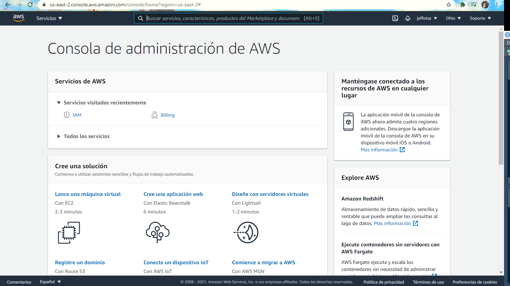

- 2: Ahora vamos a seleccionar "Lance una máquina virtual con EC2":

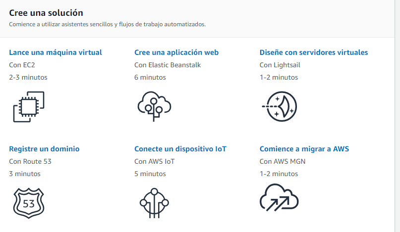

- 3: De las opciones disponibles, vamos a elegir la de Ubuntu Server 20.04 LTS de 64 bits x86

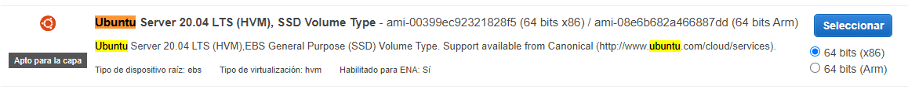

- 4: Selecciona una Free tier eligible, t2.micro como aparece a continuación:

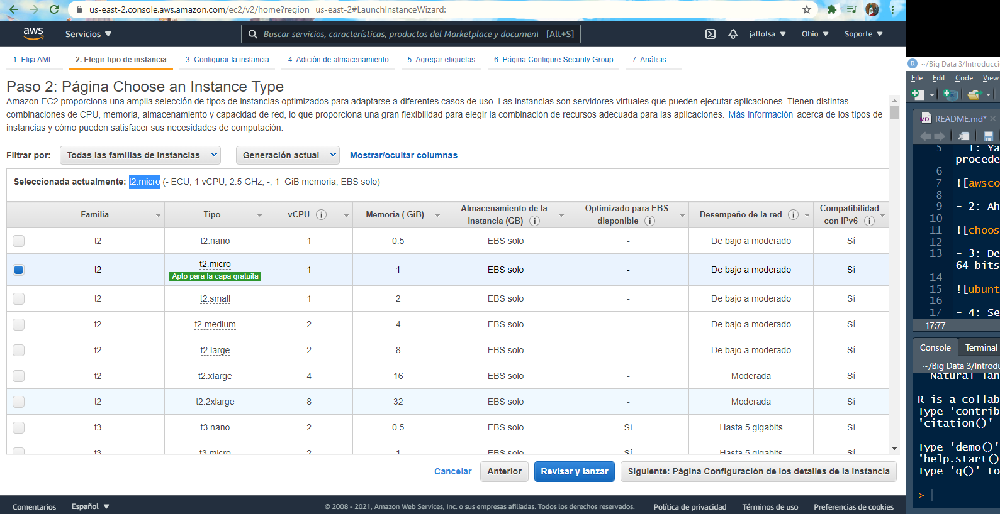

- 5: Ahora saltate hasta el paso 6 y agrega una regla llamada "Todo el TCP"

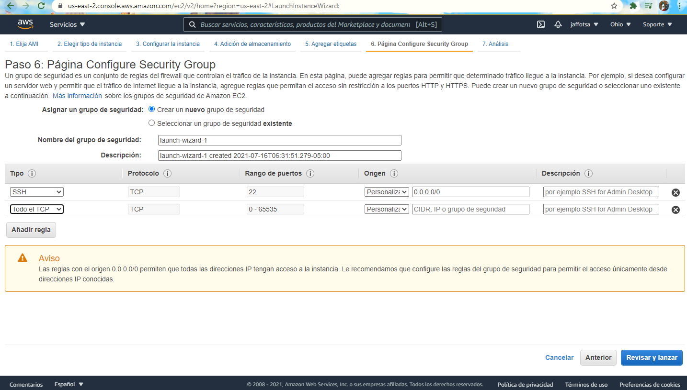

- 6: Haz un review del lanzamiento de tu instancia. Si todo ha salido bien, debería aparecerte algo similar:

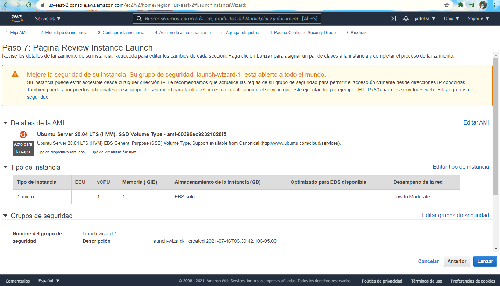

- 7: Al hacer clic en Iniciar, verá una ventana emergente que le permitirá generar un nuevo par key-value para su instancia - Esto generará una clave pública y claves privadas para su instancia. La clave pública se almacena en una instancia de Amazon, mientras que debe descargar la clave privada.
Haga clic en Descargar el par de claves. Esto descargará un archivo .pem en su computadora. Guárdelo en un lugar seguro.

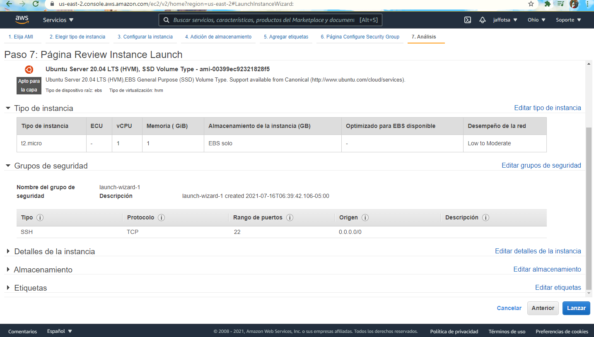

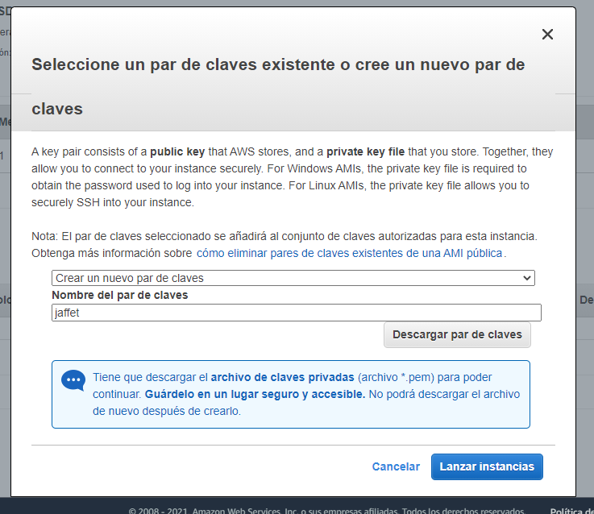

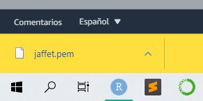

Después de descargar el archivo .pem, haga clic en Iniciar. Esto llevará algún tiempo y mostrará la siguiente página:

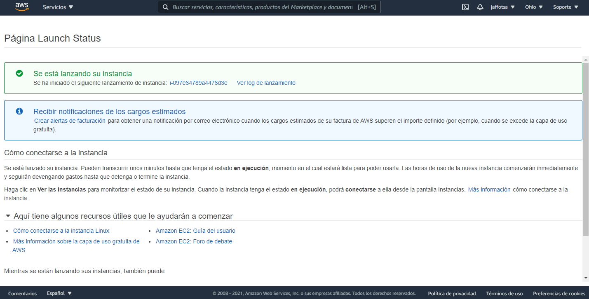

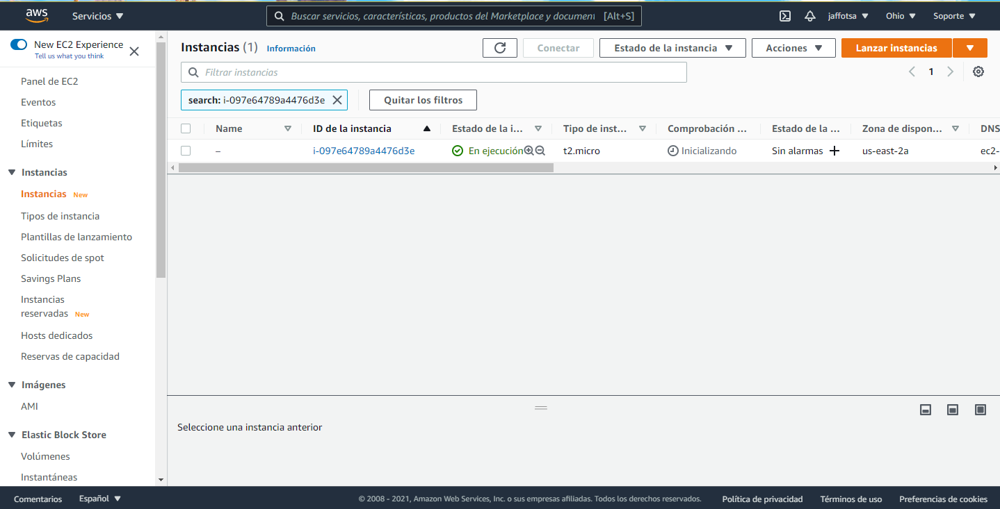

¡Felicidades! Has creado una máquina virtual de EC2 para trabajar con Spark.

