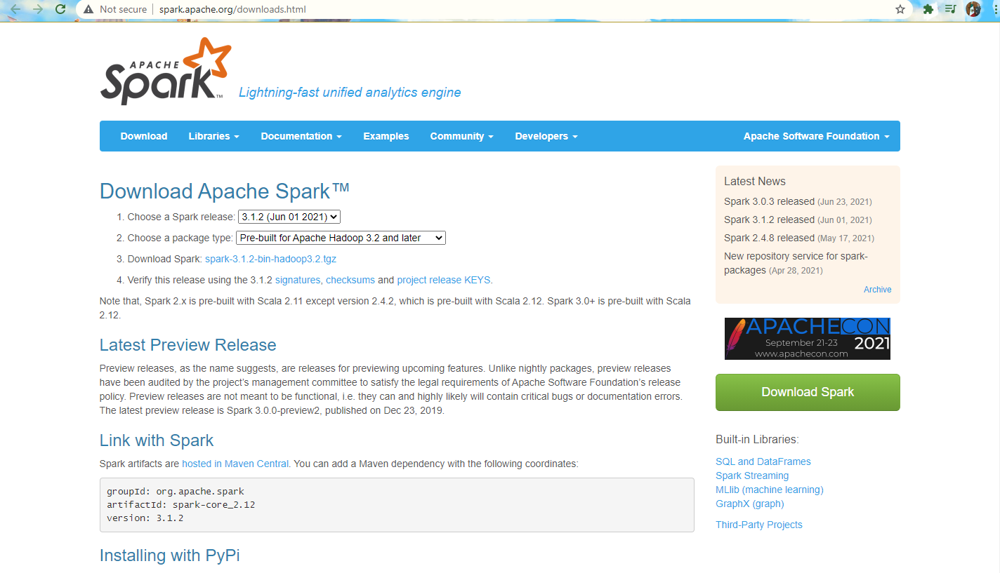

# Ejemplo 4 - Configurando e instalando Python, Java, Scala y Spark

# Configurando Spark

Apache Spark se puede configurar en los siguientes modos:

- Modo autónomo o Standalone
- Modo distribuido o en clúster

## Prerequisitos para instalar y correr Spark: Contar con Linux, Java, Scala y Python

- Es escencial y fundamental contar con Linux OS. Spark es más compatible con cualquier versión del sistema operativo Linux. Puede usar cualquier escritorio, máquina virtual, servidor o una máquina en la nube para instalar Spark. Aunque puede instalarlo Windows, estamos usando la máquina Ubuntu AWS para configurar Spark debido a que naturalmente, por eficiencia informática, costos y buena praxis en la industria, las distribuciones Linux se usan en la enorme y amplia mayoría de los casos para administrar Big Data.

- Scala / Python / Java: Spark admite API en varios lenguajes, incluidos Scala, Python y Java. Todas las API de transformaciones y acciones de Spark están disponibles en estos diferentes idiomas.

# Instalación de Java
Puede utilizar los siguientes comandos para instalar Java en su sistema:

```
sudo add-apt-repository ppa:webupd8team/java -y

sudo apt install java-common oracle-java8-installer oracle-java8-set-default
```

# Instalación de Scala
Si tiene el archivo .tar de Scala (por ejemplo, scala-2.12.6.tgz), cópielo en una instancia de AWS EC2 Linux en cualquier ubicación (por ejemplo, / opt):

- También puede descargar el archivo binario .tar.gz más reciente de http://www.scala-lang.org/download/all.html
- Puede descargar 2.12.6 desde la siguiente ubicación: https://downloads.lightbend.com/scala/2.12.6/scala-2.12.6.tgz

### Nota importante:

El archivo / opt es una carpeta vacía dentro de la raíz de la mayoría de las carpetas operativas basadas en Linux. Aquí, podemos usar esta carpeta para copiar e instalar software. De forma predeterminada, esta carpeta es propiedad de root. Ejecute el siguiente comando si tiene problemas de permisos al acceder a esta carpeta

```
sudo chmod -R 777 /opt
```

- Para instalar Scala, vaya a la ubicación donde dopió su archivo .tgz en su máquina Linux:

```
cd /opt
tar -xzvf scala-2.12.6.tgz
```

Ahora, Establezca la variable de entorno en .bash_profile, de la siguiente manera:

```
nano ~/.bash_profile
```

Agregue las siguientes líneas al final del archivo:

```
export SCALA_HOME=/opt/scala-2.12.6
export PATH=$PATH:$SCALA_HOME/bin
```

Ejecute el siguiente comando para actualizar las variables de entorno en la sesión actual:

```
source ~/.bash_profile
```

Compruebe si hay una instalación de Scala ejecutando el siguiente comando:

```
scala -version
```

# Instalar Python

Instalar Python es mucho más sencillo que Scala. Use los siguientes comandos en su Prompt Line:

```
sudo apt-get update
sudo apt-get install python3.6
```

# Instalar Spark

Siga estos pasos para instalar Spark 3.1.2. Descarguelo de la siguiente liga: http://spark.apache.org/downloads.html.



Vaya a la ubicación donde ha copiado el paquete de software Spark y descomprímalo:
```
cd / opt
tar -xzvf spark-3.1.2-bin-hadoop2.7.tgz
```
Establezca la variable de entorno en .bash_profile, de la siguiente manera:

```
nano ~ / .bash_profile
```

Agregue las siguientes líneas al final del archivo:
```
export SPARK_HOME = / opt / spark-3.1.2
export PATH = $ PATH: $ SPARK_HOME / sbin
export PATH = $ PATH: $ SPARK_HOME / bin
```

Ejecute el siguiente comando para actualizar las variables de entorno en la sesión actual:
```
source ~ / .bash_profile
```

# ¡Enhorabuena!

Hemos concluido de instalar los pre-requisitos de Spark y Spark mismo en tu máquina Linux