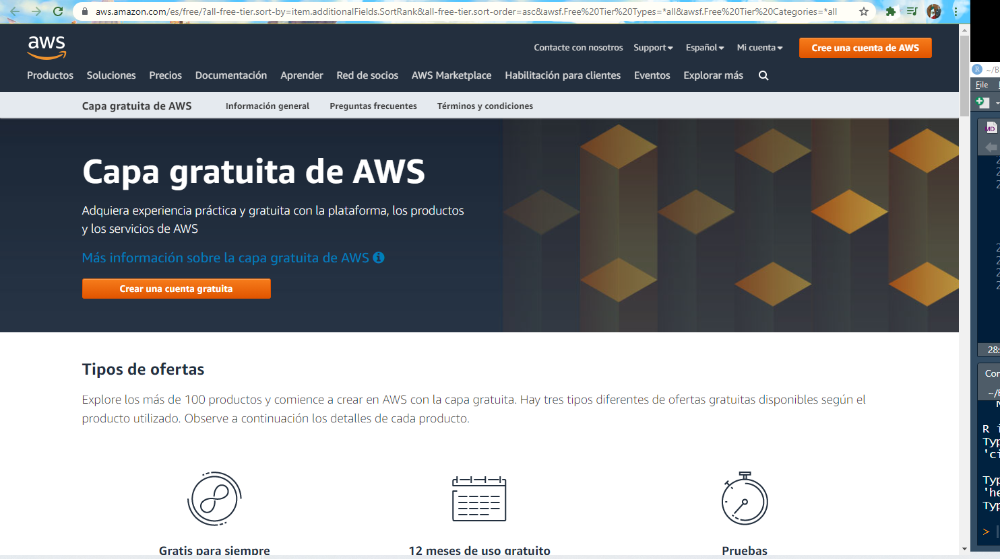

# Reto 2 - Instalación de Spark

## Objetivo

* Instalar Apache Spark y sus derivados de forma eficaz en una máquina virtual o en una distribución Linux

## Desarrollo

Previamente, comprendidos y aprendimos conceptualmente como se estructura Spark, y como es su arquitectura. A contunuación, vamos a configurar Spark en diferentes modos y distintas API's.

Lo que veremos en este y próximo ejemplos y retos es:
- Creación de un solo nodo (instancia EC2 de Linux) en la nube de AWS
- Instalar Java en una instancia
- Instalar Python en una instancia
- Instalar Scala en una instancia
- Instalar Spark en una instancia
- Cómo acceder a diferentes clientes de componentes Spark en una instancia

## ¡Vamos a la práctica!

# AWS Elastic Compute Cloud (EC2)

Amazon Web Service (AWS) es una popular plataforma en la nube que ofrece diversas ofertas de infraestructura como servicio (IAAS), plataforma como servicio (PAAS) y software como servicio (SAAS). AWS proporciona instancias EC2 escalables como nodos (máquinas) con recursos configurables (RAM y nodes). También proporciona Simple Storage Service (S3) como almacenamiento escalable y de bajo costo.

## Ahora bien, el reto es:

- Crea una cuenta gratis de Amazon AWS en la siguiente liga https://aws.amazon.com/free . Lo que debes hacer es darte de alta con tu nombre completo, correo electrónico y demás datos solicitados por la plataforma. En caso de contar con algún problema al respecto, por favor consulta a tu Experto asignado o TA.

