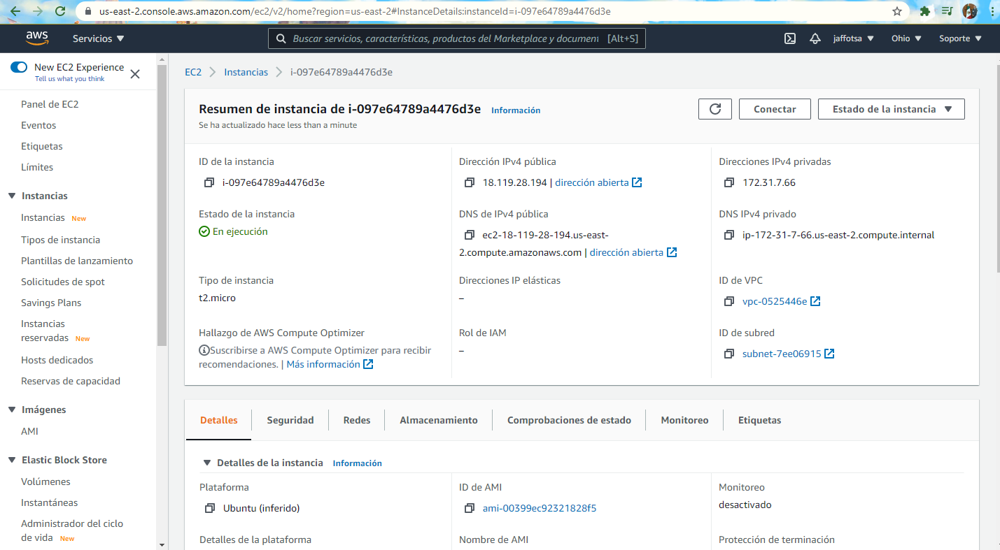
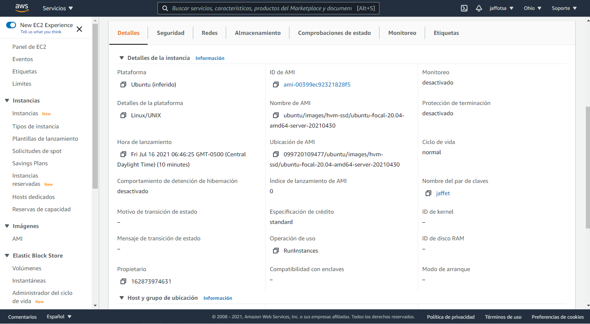
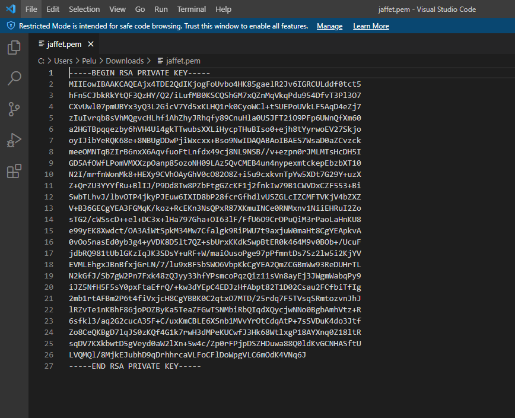
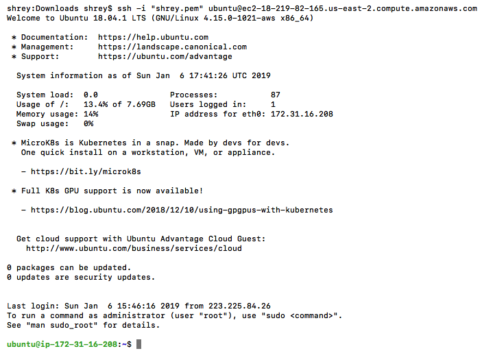

# Reto 3 - Generar una conexión a tu máquina o instancia de Linux recién creada en Ubuntu de AQS

## Objetivo

* Generar una conexión estable y con éxito a tu instancia de Linux Ubunt con el provecho y uso de SSH (Secure Shell Protocol).

- El reto consta de que conectes tu máquina virtual EC2 de Ubuntu en la nube de Amazon a tu máquina local Linux o el virtual machine que generaste en Windows. Apoyate en las sesiones previas de Hadoop donde se estudiaron la conexiones SSH. Puedes apoyarte en todo momento de tu Experto

## Solución

Antes de desarrollar la solución, Amazon nos ofrece documentación de calidad y gratuita para generar la conexión en Linux mediante SSH a sus servicios ED2. Disponible aquí: https://docs.aws.amazon.com/AWSEC2/latest/UserGuide/AccessingInstancesLinux.html

Una vez que descargue el archivo .pem, vaya a sus instancias en AWS y selecicone la pestaña de detalles para obtener información sobre su máquina virtual:





Al abrir tu archivo .pem, aparecerá de esta forma: funciona como una clave sincrónica de seguridad para generar una conexión entre dos máquinas:



Una vez descargado tu archivo .pem, aplica los siguientes permisos para obtener la información pertinente de tu máuqina virtual para poder generar la conexión de nuestro interés:

- Establezca el permiso del archivo .pem en 400 y proporcione una ruta completa en el comando ssh
- El nombre de usuario predeterminado para la AMI de Ubuntu es ubuntu
ec2-18-219-82-165.us-east-2.compute.amazonaws.com es el nombre de host de la instancia
- Puede obtener el nombre de host (DNS público (IPv4)) y otros detalles de la máquina desde el panel de la instancia EC2.

Para la instancia que hemos creado, podemos conectarnos a la máquina con los siguientes comandos en tu Command Prompt:

```
chmod 400 shrey.pem

ssh -i "shrey.pem" ubuntu@ec2-18-219-82-165.us-east-2.compute.amazonaws.com
```

Verás la siguiente pantalla:



¡Felicidadez!Una vez que inicie sesión en su instancia de Amazon, su máquina estará listo para instalar lo que necesitaremos a continuación.