# Ejemplo 3 - Arquitectura de Cassandra, Data distribution y keyspace

## Objetivo

* Comprender y dominar de forma epxloratoria la Arquitectura de Cassandra
* Dominar conceptualmente la forma en como Cassandra opera en modo clúster
* Entender la distribución de datos dentro del paradigma de NoSQL en Cassandra
* Introducir al alumno el concepto y uso de Keyspace en Cassandra
* Que el alumno aprenda como crear una database y schema en Cassandra

## Desarrollo

Ahora que sabemos cómo configurar y ejecutar un clúster de Cassandra, demos otro paso y analicemos la arquitectura de Cassandra. Cassandra es una gestor de bases de datos NoSQL distribuida y de alta disponibilidad. Los clústeres de Cassandra pueden escalarse linealmente en función de nuestros requisitos de carga.

# Un poco más de contexto de Cassandra

El diseño de Cassandra se basó en Bigtable de Google y DynamoDB de Amazon, y fue desarrollado en Facebook. Más tarde, fue otorgado a la Fundación Apache y se hizo de código abierto. Mientras trabajamos con Cassandra, no debemos preocuparnos por la normalización de nuestras tablas, ya que Cassandra promueve la desnormalización. El esquema de la base de datos está diseñado en función de los datos que vayas a usar.

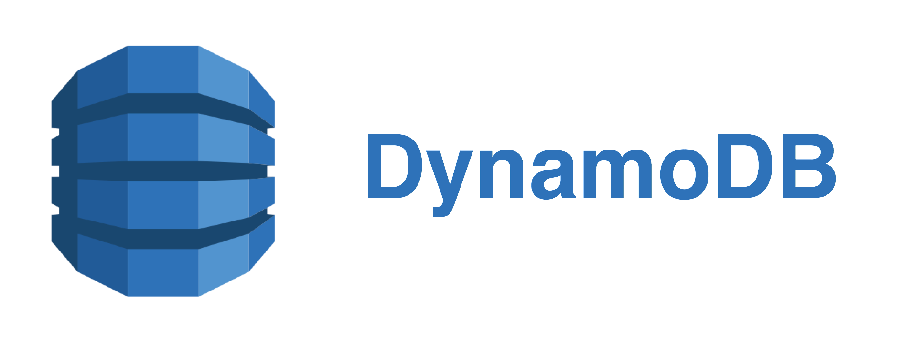

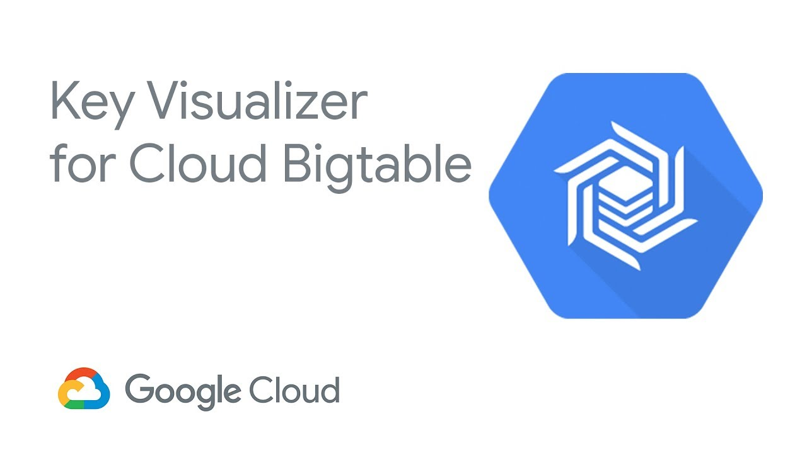

Cassandra se centra en la disponibilidad y la tolerancia de partición entre la coherencia, la disponibilidad y la tolerancia de partición del teorema de CAP o tambien conocido como Teotema de Brewer. El teorema de CAP establece que, entre consistencia, disponibilidad y tolerancia de partición, solo puede elegir dos a la vez. Aquí, la coherencia significa que cuando lee o escribe en cualquier nodo del clúster, debe obtener los mismos datos actualizados. La disponibilidad se refiere al hecho de que deberíamos poder acceder al clúster incluso si algún nodo del clúster está inactivo, y la tolerancia de partición significa que nuestro clúster debería ser funcional incluso si la comunicación entre los nodos de un clúster está rota. Aquí te presentamos un diagrama de Venn que explica que ofertas de software cumplen con ciertas condiciones del teorema y cuales no:

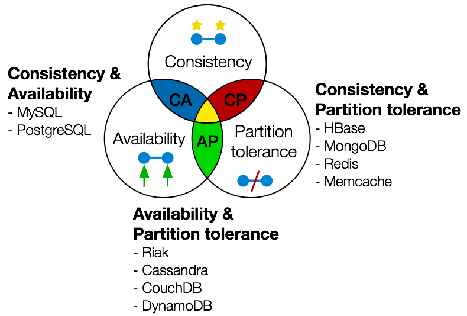

Cassandra tiene la flexibilidad para permitirnos elegir entre una consistencia fuerte o una consistencia eventual. Aquí, la consistencia eventual significa que cuando se completa una operación de escritura, los datos se sincronizarán con todos los nodos del clúster que son responsables de atender estos datos, tarde o temprano. Sin embargo, si elegimos una consistencia fuerte, la latencia aumenta.

# ¿Cómo funcionan los Clusters de Casssandra?

Recuerda que en Cassandra, los clúster se comunican de igual a igual: ningún nodo es maestro o esclavo. Los datos se distribuyen entre todos los nodos del clúster mediante particionadores. Esto permite a Cassandra fragmentar datos de forma transparente y permite escalar linealmente. Esto significa que el servidor realiza la fragmentación de datos y la capa de aplicación no necesita implementar ninguna lógica adicional para la fragmentación. A medida que aumenta la carga, se pueden agregar nuevos nodos para compartir la carga, ya que Cassandra distribuirá la carga entre ellos automáticamente. Para ilustrar esta situación, te lo ilustraremos con un ejemplo:


Imaginemos que inicialmente tenemos un clúster de tres nodos, que son capaces de manejar transacciones 3x. Ahora, suponga que la carga aumenta a 4x, luego podemos agregar un nodo adicional al clúster sin hacer ningún cambio en nuestra capa de aplicación. La siguiente imagen muestra el ejemplo en el que inicialmente tenemos un clúster de tres nodos con los nodos A, B y C capaces de manejar la carga 1x cada uno; por lo tanto, la capacidad de manipulación de carga de 1x + 1x + 1x = 3x. Sin embargo, más adelante, agregamos un nodo D más de capacidad 1x a nuestro clúster. Ahora, nuestro clúster puede manejar 3x + 1x = 4x de carga. Cassandra también distribuirá datos automáticamente entre el cuarto nodo recién agregado, y este nuevo nodo comenzará a atender las solicitudes entrantes de lectura y escritura:

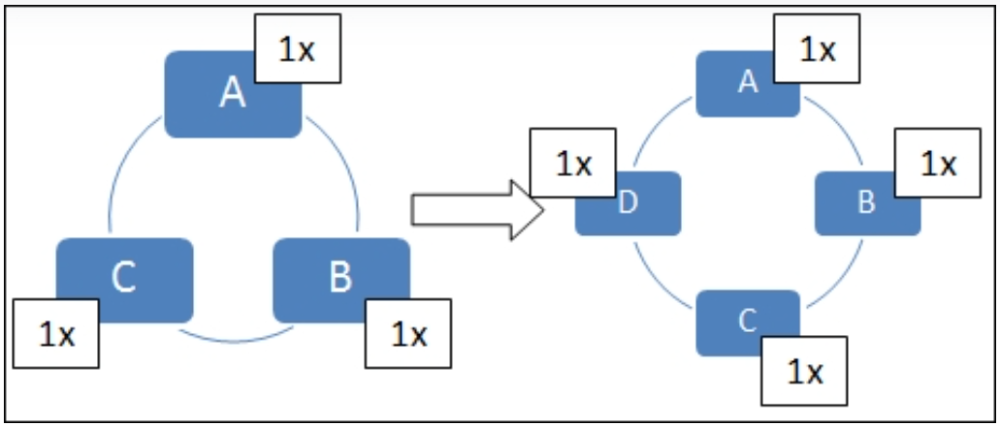

# El protocolo "Chismoso" o gossip

Los nodos de Cassandra utilizan el protocolo Gossip para conocer la ubicación y el estado de otros nodos del clúster. Cada nodo inicia periódicamente una tarea de "cotilleo","chismoseo" o gossipier de aquí en adelante, que actualmente es de 1 segundo, para conocer el estado de otros nodos a través del cotilleo.

Durante una sesión de gossip. La selección de nodo se realiza de la siguiente manera:

- Primero, Gossip a algún punto final aleatorio.
- Luego, hace gossip a un punto final inalcanzable aleatorio
- Si el nodo del que se ha hablado en el paso 1 no es un nodo semilla, entonces se comunicará efectivamente con un nodo semilla.

Una sesión de gossip consta de tres mensajes: _DigestSyn, DigestAck y DigestAck2_. Una sesión de gossip típica, donde el nodo A declara a algún nodo B aleatorio es como se muestra en la siguiente figura:

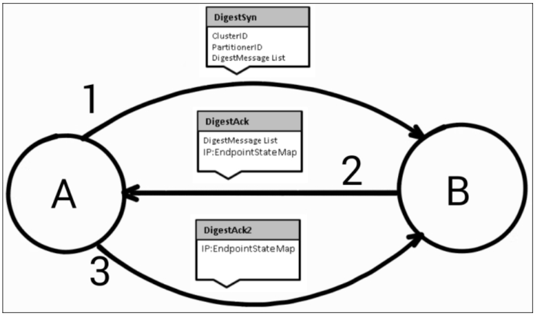

Como podemos ver, el nodo A envía primero un mensaje DigestSyn al nodo B. Al recibir este mensaje, el nodo B responde con el mensaje DigestAck, que contiene una lista de funciones DigestMessage y un mapa de EndpointState, que usa la dirección IP del nodo como un clave. Como podemos ver en la figura, el nodo A finalmente completa la sesión de gossip enviando el mensaje DigestAck2.

# Pero a todo esto... expliquemos sobre estos mensajes:

## DisgestSyn
Aquí, un nodo envía tres cosas a otro nodo:

- Valor de identificación del clúster que hemos definido en su archivo cassandra.yaml
- El algoritmo del particionador que está utilizando el nodo, y;
- La lista de mensajes de resumen recibidos de otros nodos en la sesión anterior de Gossip.

## DigestMessage
Se compone de tres entidades

- Dirección IP de punto final del nodo al que pertenece este DigestMessage
- Número de generación que informa sobre el estado de reinicio del nodo; en el nodo se reinicia el número de cambios de generación.
- Número de versión del mensaje de resumen.

# Data distribution en Cassandra

Una de las características clave de Cassandra es la fragmentación automática de datos: ¡si, lo hace de forma automatizada!. Los datos se distribuyen entre los nodos de un clúster en función de las claves de partición de forma automática. Una clave de partición es una columna o varias columnas, que forman parte de una clave principal de una familia de columnas. Los datos se distribuyen en función del valor tokenizado calculado sobre la clave de partición. Un particionador determina cómo se calculan los tokens de distribución, y a su vez, cada nodo del clúster de Cassandra posee una variedad de tokens, donde encontramos que una fila se almacena en el nodo que posee el token respectivo de la clave de partición de la fila.


Se puede configurar un particionador usando la opción de configuración de particionador en cassandra.yaml. El nuevo clúster debería ir con Murmur3Partitioner, ya que es un particionador más rápido que los anteriores y también distribuye datos de manera más eficiente. Otros particionadores para compatibilidad con versiones anteriores son RandomPartitioner, ByteOrderedPartitioner y OrderPreservingPartitioner.

Aquí hay una breve descripción de todos los particionadores enumerados:

- Murmur3Partitioner: este es el particionador predeterminado. Calcula tokens basándose en el hash MurmurHash. El valor del token varía de -264 a 264-1.

- RandomPartitioner: este es el particionador predeterminado anterior. Los tokens se calculan en función del hash MD5. El valor del token varía de 0 a 2127.

-ByteOrderedPartitioner: se basa en almacenar datos en orden lexicográfico de bytes de clave de partición. Por lo general, no se recomienda, ya que algunas particiones aquí son más activas y pueden crear puntos de acceso. Estos puntos de acceso cambiarán según las cargas de trabajo, por lo que administrarlos puede ser un desafío.

- OrderPreservingPartitioner: es similar a ByteOrderedPartitioner con los mismos desafíos junto con una limitación adicional que asume que las claves son cadenas UTF8.

## Nota importante:
Cassandra es independiente de la nube o servidor donde decidamos alojar nuestros datos. No le importa dónde los coloques: en las instalaciones de la empresa en Reforma o Insurgentes, un proveedor de nube o varios proveedores de nube estilo Azure y AWS. Puedes utilizar una combinación de estos para una sola base de datos. Eso les da a los desarrolladores de software y a los analistas de datos máxima flexibilidad.


## Breve ejemplo:

Analicemos un ejemplo para comprender la distribución de datos utilizando la generación de tokens basada en hash, por ejemplo, Murmur3Partitioner. Supongamos que tenemos una familia de columnas llamada usuarios con el nombre de usuario como clave de partición y un grupo de cuatro nodos:

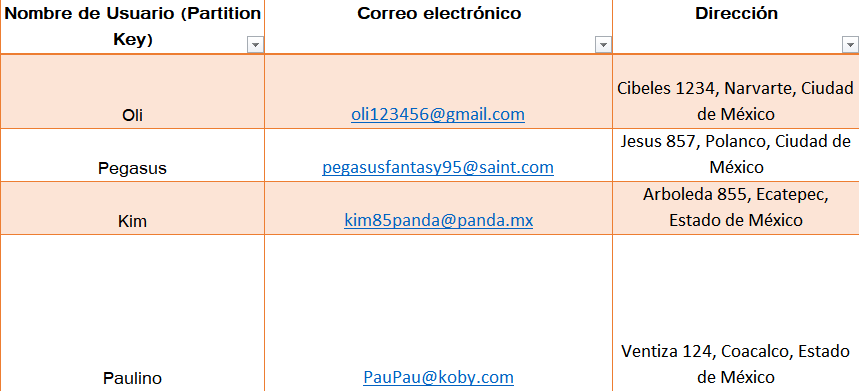

## Nota:
no estamos usando los valores hash reales para las claves de partición. Además, estamos tomando un rango de tokens muy pequeño, es decir, de -23 a 23-1, en lugar de -264 a 264-1, que es el rango de tokens real.

La siguiente tabla muestra los valores hash reales y los valores hash imaginarios como ejemplo:

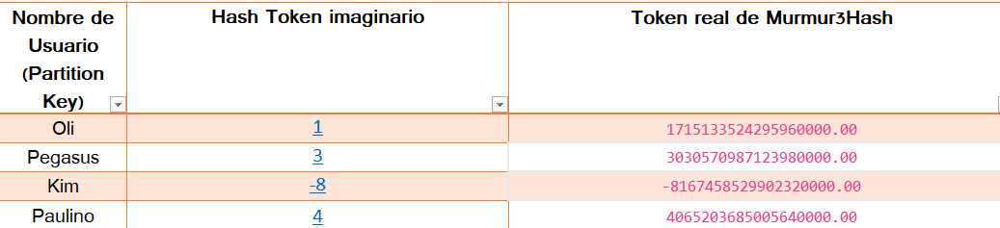

Ahora, lee a detalle: el rango de tokens de -8 a 7 se distribuye entre cuatro nodos, como se muestra en la siguiente figura. Aquí, el nodo A tiene tokens con valores mayores o iguales a -8 y menores que -4, el nodo B tiene tokens para un rango mayor o igual a -4 y menor que 0, el nodo C tiene tokens con valor mayor o igual que a 0 y menos de 4, y el nodo D tiene un rango mayor que igual a 4 y menos de 8:

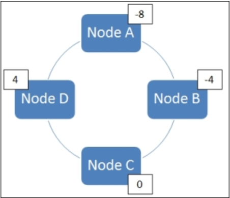

Entonces, nuestra primera fila cuya clave de partición es Oli con valor de token 1 irá al nodo C ya que el nodo C posee ese rango de token. De manera similar, Pegasus, Kim y Paulino irán al nodo C, al nodo A y al nodo D, respectivamente.

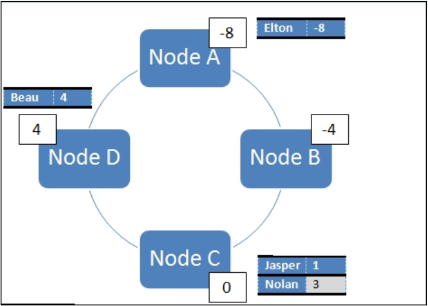

# Keyspace: un concepto elemental en Cassandra

Un keyspace es un contenedor de datos en Cassandra, similar a una base de datos en los sistemas de administración de bases de datos relacionales (RDMBS o mejor y uiniversalmente conocidas como SQL). Un clúster tiene un keyspace por aplicación, tantas como sean necesarias, según los requisitos y el uso del sistema. Los kesypace son entidades completamente independientes y los datos que contienen no están relacionados entre sí.

En un clúster de Cassandra, un keyspace es un objeto más externo que determina cómo se replican los datos en los nodos. Los Keyspace consisten en objetos centrales llamados familias de columnas o column families (que son como tablas en SQL), las cuales al final terminan siendo filas indexadas por claves, tipos de datos, conocimiento del centro de datos, factor de replicación y estrategia de keyspace.

## Los componentes de Keyspace

## Replication Strategy

Al definir un espacio de claves, la estrategia de replicación especifica los nodos donde se colocarán las réplicas. Al usar varios nodos para colocar réplicas, logra tolerancia a fallas, alta disponibilidad y confiabilidad.

Hay dos estrategias posibles:

- Estrategia simple. Use this strategy for test and development environments, and if you do not intend to deploy a cluster to more than one data center. The replication factor applies to the whole cluster. The partitioner decides where to put the first replica on a node. Then, other replicas are distributed clockwise on the next nodes irrespective of data center or location.
- Network Topology Strategy o Estrategia de Topología de Red: Esta estrategia es adecuada cuando necesita implementar su clúster en varios centros de datos. Sin embargo, puede usarlo incluso con un solo centro de datos para que pueda expandirse más adelante. La estrategia de topología de red funciona tanto para la producción como para el desarrollo. Tiende a colocar réplicas en nodos que no están en el mismo bastidor para evitar problemas cuando un bastidor se cae. Cada centro de datos puede tener un factor de replicación independiente al usar esta opción.

## Replication Factor

Esta configuración define cuántas réplicas de una fila almacenar en cada nodo.

El mínimo debe ser dos réplicas por centro de datos. Esto significa que la falla de un nodo no afecta el funcionamiento de un grupo de replicación. Por lo tanto, la configuración recomendada es tener tres copias de cada fila en diferentes nodos para lograr una tolerancia a fallas satisfactoria. La regla general es mantener el factor de replicación igual al número de nodos. La sintaxis básica es:

```
CREATE KEYSPACE <em>keypsace_name</em> WITH replication = {<em>properties}</em>;
```

Puedes hacer lo mismo con cqslh. Esta es la síntaxis:

```
CREATE KEYSPACE test_keyspace
WITH replication = {'class':'SimpleStrategy', 'replication_factor' : 3};
```

Utiliza el ejemplo anterior cuando no vayas a usar a varios centros de datos, es decur, uses uno solo. Además, si solo tiene un nodo y está utilizando Cassandra para las pruebas, puede establecer replication_factor en 1.

Para entornos de producción y múltiples centros de datos, cree un espacio de claves con la estrategia de replicación de topología de red.

Para hacerlo, ingrese:

```
CREATE KEYSPACE keyspace_network_topology
WITH replication = {'class':'NetworkTopologyStrategy', 'datacenter1' : 3};
```

El nombre del centro de datos predeterminado es datacenter1. Para verificar el nombre de su centro de datos, cierre el shell CQL y usa nodetool:

```
nodetool status
```

# Creando uan database y un schema en Cassandra

Un esquema de base de datos de Cassandra tiene los siguientes componentes principales que ya hemos revisado previamente: keyspace, family column y el famoso Primary Key de toda la vida justo hecho para family column. Analicémoslos con cierto detalle.

## Más sobre column Family

Una familia de columnas o family column almacena los datos en forma de filas y columnas, similar a una table de SQL. Una fila de Cassandra se identifica mediante una clave de fila, también llamada clave de partición. La fila de Cassandra podría tener una o más filas lógicas. Estas filas lógicas se identifican mediante la primary key de la familia de columnas. La clave principal de una familia de columnas debe ser única. En la siguiente sección del capítulo veremos que una primary key está compuesta por una clave de partición y cero o más columnas de agrupamiento. La fila de Cassandra, que solo puede tener una fila lógica, se denomina fila estática y si la fila de Cassandra puede tener una o más filas lógicas, se denomina fila ancha. La clave de partición decide en qué nodo residirán todas las filas lógicas para esa clave de partición. Esto implica que una fila de Cassandra de un valor de clave de partición determinado siempre reside completamente en un nodo de Cassandra con todas sus filas lógicas en el mismo nodo; sin embargo, las filas de Cassandra con diferentes valores de clave de partición pueden o no residir en el mismo nodo de Cassandra.

Una fila se compone de columnas y una columna tiene dos partes: nombre de columna y valor de columna. En una fila, las columnas se ordenan por nombres de columna, como se muestra en la siguiente tabla:

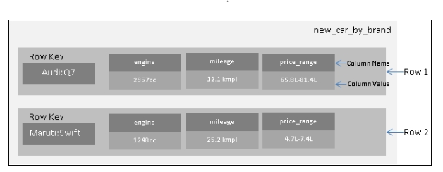

Por ejemplo, en la tabla anterior, tenemos una familia de columnas llamada new_car_by_brand. Tiene dos filas. Cada fila tiene una clave de fila definida por la marca y el modelo de la columna, por ejemplo, Audi: Q7 y Maruti: Swift. Cada fila tiene tres columnas con los nombres motor, kilometraje y rango de precio. También pudimos ver que los valores de las columnas se almacenan ordenados según los nombres de las columnas.

## Creando una tabla en Cassandra

La sentencia _CREATE TABLE_ se utiliza para crear una tabla. Además de la columna, los tipos de columna y la definición de clave principal, una tabla tiene las opciones que se muestran a continuación. Si no especificamos estas opciones durante la creación de la tabla, se utilizan los valores predeterminados respectivos.

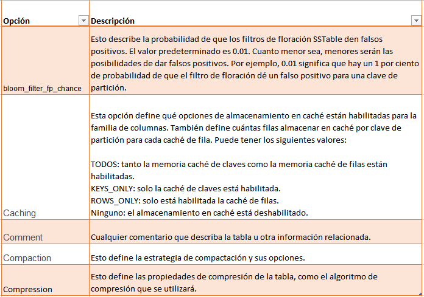

El siguiente es un ejemplo de cómo crear una tabla cambiando el valor de la opción gc_grace_seconds a 864000 (10 días) de 8640000 (100 días):

```
CREATE TABLE status_updates_by_user( userid text, updated_on timestamp, status text, PRIMARY KEY (userid, updated_on)) WITH gc_grace_seconds = 864000
```

Una familia de columnas en Cassandra puede tener dos tipos de filas, filas estrechas o estáticas (static rows) y filas anchas (wide rows). Veamos.

## Filas estáticas
Una fila estática tiene un número fijo de columnas. Una familia de columnas sin clave de agrupamiento siempre tendrá un número fijo de filas por clave de partición, por lo tanto, esto se denomina tabla de filas skinny o estrecgas. A continuación, se muestra un ejemplo de una tabla con filas skinny:

```
CREATE TABLE schemabuilder.users (
userid text PRIMARY KEY,
address text,
alternate_phone text,
firstname text,
lastname text,
primary_phone text
)
INSERT INTO users (userid, address, firstname , lastname , primary_phone ) VALUES ( 'gaurav', 'sec-9 delhi', 'gaurav', 'pandey', '142233');
INSERT INTO users (userid, address, firstname ,lastname , primary_phone, alternate_phone ) VALUES ( 'nitinp', 'sec-15', 'nitin', 'padalia', '112233', '554422');
SELECT * FROM users ;

userid | address     | alternate_phone | firstname | lastname | primary_phone
--------+-------------+-----------------+-----------+----------+---------------
gaurav | sec-9 delhi |            null |    gaurav |   pandey |        142233
nitinp |      sec-15 |          554422 |     nitin |  padalia |        112233
```

Aquí, cada clave de partición (userid, en este caso) puede tener solo una fila.

## Wide Rows o Filas anchas

Las filas anchas pueden tener un número variable de filas por clave de partición. Una familia de columnas con columnas agrupadas puede tener filas variables por clave de partición. Por ejemplo, una familia de columnas de "actualizaciones de estado"" de una batabse sobre usuarios de por ejemplo, un sitio web, con userid como clave de fila y status_update_time como clave de agrupación puede tener varias filas lógicas por clave de fila de Cassandra para una clave de partición determinada, como se indica a continuación:

```
CREATE TABLE user_status_updates (
useridtext,
status_update_time timestamp,
status_msg text,
PRIMARY KEY (userid, status_update_time)
)
// Insert two row with same row key
INSERT INTO user_status_updates (userid, status_update_time ,status_msg ) VALUES ( 'nitinp', '2015-03-02 10:00:02', 'hello world')
INSERT INTO user_status_updates (userid, status_update_time ,status_msg ) VALUES ( 'nitinp', '2015-01-02 10:00:02', 'good morning all')
SELECT * FROM user_status_updates ;

userid | status_update_time       | status_msg
--------+--------------------------+------------------
nitinp | 2015-01-02 10:00:02+0530 | good morning all
nitinp | 2015-03-02 10:00:02+0530 |      hello world
```

## Primary Key